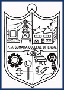
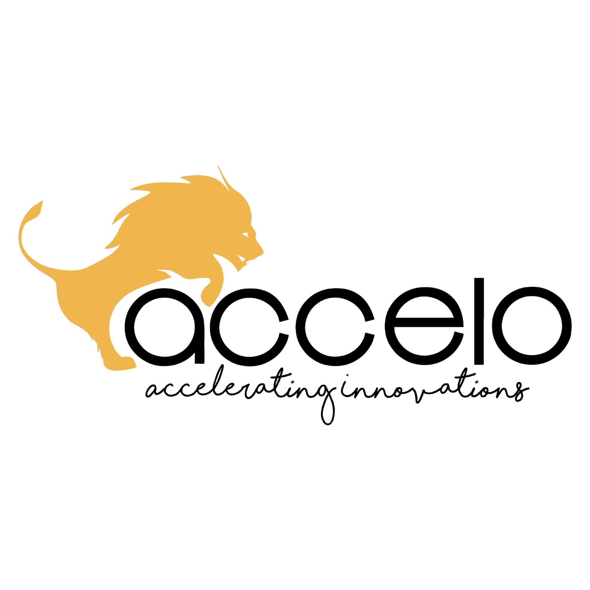
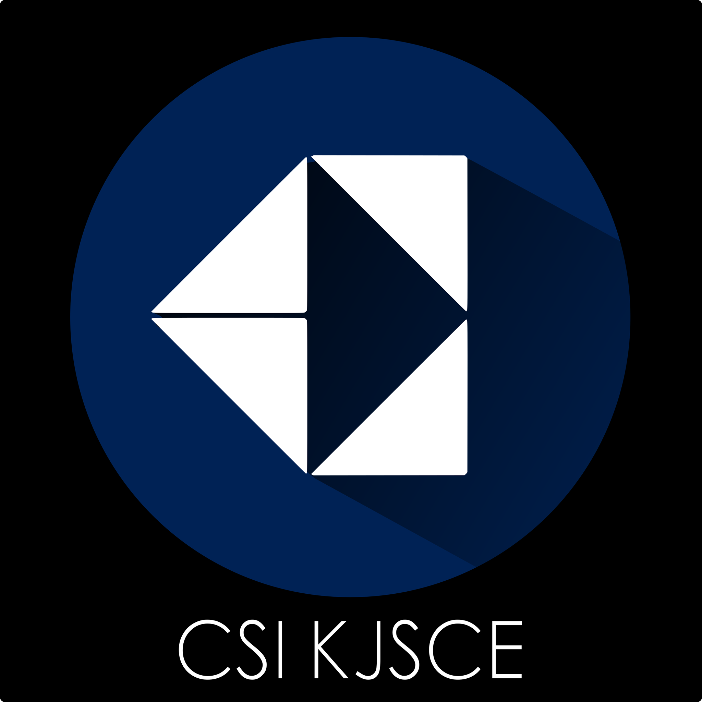

------
I am an incoming graduate student in the Master's in Computer Science program at [Northwestern University](https://www.mccormick.northwestern.edu/computer-science/). My areas of research include Machine Learning, Deep Learning and Reinforcement Learning. 

My goal is to make AI a tool which would be accessible to people of every discipline. I have always been enthralled by Computer Science as it is one of the few fields where practical results can be achieved quickly. I believe that by amalgamating AI with Computer Science,  people from all disciplines will be able to satisfy their curiosity, get practical results, perform better research and solve problems faster. 

I have completed my Bachelors in Technology (B.Tech) in Computer Engineering from [K.J Somaiya College of Engineering](https://kjsce.somaiya.edu/kjsce/). My final year project was titled "Simulation Environment for Development and Testing of Autonomous Learning Agents". You can check out the paper over [here.](https://papers.ssrn.com/sol3/papers.cfm?abstract_id=3367735)

Other than technology, I am an avid foodie and I love trying out new dishes. I also love travelling, reading manga and watching tv series and anime.   

My CV can be found [here.](add link later)

Experience
-----

**Deep Learning Intern, K.J Somaiya College of Engineering** 
#### January 2018 to April 2018
-----
I have worked under Prof. Grishma Sharma and we researched different methodologies of k-shot learning for facial recognition system. We developed a facial recognition system which can be trained on a small number of samples (k samples) to perform fast and accurate recognition of faces. The link to the paper can be found [here.](https://www.ijcaonline.org/archives/volume181/number18/29966-2018917871)

-----

**Machine Learning Intern, Accelo Innovation** 
#### August 2017 to October 2017
-----
Accelo Innovation is a tech startup working in the segment of accident reduction and assistance. As a machine learning intern, I worked on the following: 
* Designing of lane detection, object detection and depth mapping modules 
* Integration of the modules with a CNN model to create a usable API 

-----

**Computer Society of India, KJSCE Student's Chapter** 
##### March 2016 to July 2017
-----
I worked as a first year representative at CSI from March 2016 to July 2016. As a first year representative, I was responsible for managing different technical events and seminars conducted by CSI. Then, I worked as a second year representative from July 2016 to July 2017. As a second year representative, I was more involved and I performed the following activities: 
* Created technical content for workshops and coding questions for competitions 
* Taught in workshops like Machine Learning and Crytography 
* Managed 20+ events and seminars 

