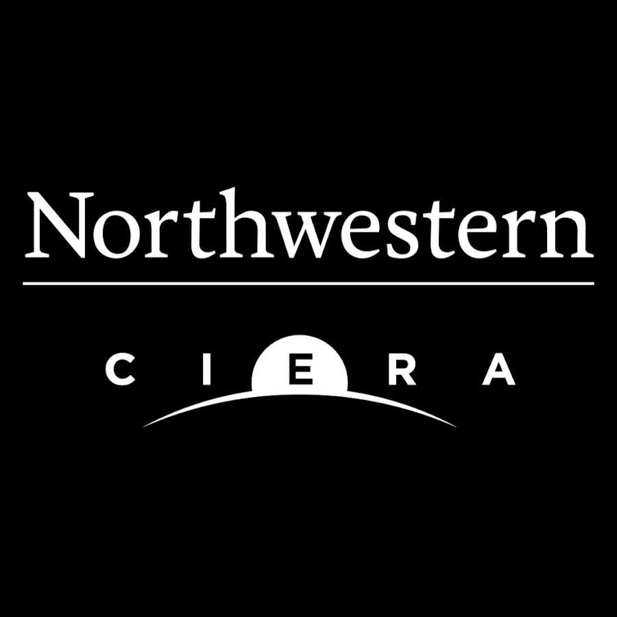

------
I am currently working as a Research Specialist at [NU Earth](https://www.earth.northwestern.edu/){:target="_blank"}. Previously, I have worked as an Applied Scientist at [Alchera Labs](https://alcherainc.com/en/){:target="_blank"}, and as a Researcher at [CIERA](https://ciera.northwestern.edu/){:target="_blank"}. 

My research interests lie broadly in Machine Learning, Deep Learning, and Reinforcement Learning. More specifically, my primary research interest is in understanding the underlying behavior and function of neural networks through empirical experiments and foundational theory, and using this knowledge to develop more intelligent systems. Additionally, I am also interested in integrating machine learning algorithms into the scientific development process across various disciplines such that it would help expedite the pace of scientific research.

I completed my M.S. in Computer Science from [Northwestern University](https://www.mccormick.northwestern.edu/computer-science/){:target="_blank"} and my B.Tech. in Computer Engineering from [K.J Somaiya College of Engineering](https://kjsce.somaiya.edu/kjsce/){:target="_blank"}. 

In my free time, I love to try out new dishes and restaurants, play tennis, read manga/manhwa, and travel/explore new places (Check out my [travel map](#travel-map)).  

My CV can be found [here.](../files/CV.pdf){:target="_blank"} Please drop me an email if you have any questions related to my research or if you are interested in a research collaboration.  

# Education
-----

<strong>Northwestern University</strong> 
<strong>M.S. in Computer Science</strong> 
<strong>Sep 2019 - Mar 2021</strong>

-----
<strong>CGPA: </strong> 4.0/4.0  
<strong>Coursework:</strong>
* <strong>Fall'19: </strong>CS349-Machine Learning, DS421-Statistics, CS496-Data Science Seminar, CS348-Intro to AI   
* <strong>Winter'20: </strong>CS496-Advanced Deep Learning, EE435-Deep Learning Foundations  
* <strong>Spring'20: </strong>CS397-Statistical Language Modeling, CS336-Algorithms  
* <strong>Fall'20: </strong>MSIA490 - Social Network Analytics 

<strong>Labs/Reading Groups: </strong>Research in Automated Listening Methods Lab (REALM), Modern Artificial General Intelligence and Computer Systems Lab (MAGICS), AI Journal Club

-----

<strong>K.J Somaiya College of Engineering</strong> 
<strong>B.Tech. in Computer Engineering</strong> 
<strong>Aug 2015 - May 2019 </strong>

-----
<strong>CGPA:</strong> 8.99/10   
<strong>Relevant coursework:</strong> Artificial Intelligence, Machine Learning (Topper), Neural Nets, Image Analysis (Topper), Fundamentals of Programming (10/10, AP), Data Structures, Algorithms, Computer Architecture (10/10), Operating Systems (Topper)  
<strong>Activities: </strong>Computer Society of India  

# Experience
-----

<strong>NU Earth</strong> 
<strong>Research Specialist</strong> 
<strong>Nov 2022 - Present </strong>

-----
Responsible for developing programming tools and machine learning algorithms for a wide range of projects.

-----

<strong>Alchera Labs</strong> 
<strong>Applied Scientist</strong> 
<strong>Jul 2021 - Oct 2022 </strong>

-----
* Developed [FireScout](https://firescout.ai/){:target="_blank"}, an early detection system for wildfires which can detect wildfire smoke with 91.6% accuracy. 
* Researched the emergence and importance of class-selective neurons during the early epochs of training and demonstrated through a set of experiments that class selectivity is essential for successful training. 
  * **Paper:** [On the special role of class-selective neurons in early training](https://openreview.net/forum?id=JaNlH6dZYk){:target="_blank"}
  * **Git repository:** [Class Selective Neurons](https://github.com/Omkar-Ranadive/Class-Selective-Neurons){:target="_blank"}

-----

<strong>CIERA</strong> 
<strong>Researcher</strong> 
<strong>Jun 2020 - Jun 2021</strong>

----- 
I was a part of [Prof. Vicky Kalogera's](https://ciera.northwestern.edu/directory/vicky-kalogera/){:target="_blank"} Research Group and was responsible for developing Machine Learning algorithms and applying ML across different projects.   
**Earthquake Detective:**   
**Advisor:** [Prof. Suzan Van Der Lee](http://geophysics.earth.northwestern.edu/seismology/suzan/){:target="_blank"} 
We compiled the first-ever ML benchmark dataset on potentially triggered seismic events and developed a ML algorithm which can detect these low-amplitude signals with high accuracy.  
**Git repository:** [Earthquake Detective](https://github.com/Omkar-Ranadive/Earthquake-Detective){:target="_blank"}  
**Website:** [Earthquake Detective crowd-sourcing platform](https://www.zooniverse.org/projects/vivitang/earthquake-detective){:target="_blank"}  
**Paper:** [Applying Machine Learning to Crowd-sourced Data from Earthquake Detective](https://arxiv.org/abs/2011.04740){:target="_blank"}

-----

<strong>Northwestern University</strong> 
<strong>Graduate Research Assistant</strong> 
<strong>Jan 2020 - Jun 2020</strong>

-----
**Advisor:** [Prof. Prem Seetharaman](https://pseeth.github.io/){:target="_blank"}  
We developed OtoWorld, an interactive environment for training reinforcement learning agents for the task of audio separation. The environment is designed to facilitate reinforcement learning research in computer audition.  
**Git repository:** [OtoWorld](https://github.com/pseeth/otoworld){:target="_blank"}  
**Paper:**  [OtoWorld: Towards Learning to Separate by Learning to Move](https://arxiv.org/pdf/2007.06123.pdf){:target="_blank"}

-----

<strong>K.J Somaiya College of Engineering</strong> 
<strong>Research Intern</strong> 
<strong>Jan 2018 - Apr 2018</strong>

-----
**Advisor:** [Prof. Grishma Sharma](https://kjsce.somaiya.edu/en/view-member/160102?type=faculty){:target="_blank"}  
Researched different methodologies of k-shot learning for facial recognition system. We developed a facial recognition system which can be trained on a small number of samples (k samples) to perform fast and accurate recognition of faces.  
**Paper:** [k-Shot Learning for Face Recognition](https://www.ijcaonline.org/archives/volume181/number18/29966-2018917871){:target="_blank"}

-----

<strong>Accelo Innovation</strong> 
<strong>Machine Learning Intern</strong> 
<strong>Aug 2017 - Oct 2017</strong>

-----
Responsible for developing lane detection, object detection, and depth mapping modules for Accelo's assistive driving system. 

-----

<strong>Computer Society of India</strong> 
<strong>Student Representative</strong> 
<strong>Mar 2016 - Jul 2017</strong>

-----
* Created technical content for workshops and coding questions for competitions 
* Taught in Machine Learning and Crytography workshops 
* Managed over 20+ events and seminars 

-----
## Travel Map
A travel map showcasing all the countries I have been to!

