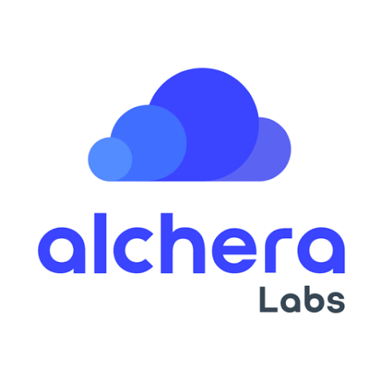

------
I am currently working as a Research Specialist at [NU Earth](https://www.earth.northwestern.edu/){:target="_blank"}. Previously, I have worked as an Applied Scientist at [Alchera Labs](https://alcherainc.com/en/){:target="_blank"} and as a Researcher at [CIERA](https://ciera.northwestern.edu/){:target="_blank"}. My research interests lie broadly in Machine Learning, Deep Learning, and Reinforcement Learning. More specifically, I am most interested in understanding the “why” behind neural networks and its processes and using this knowledge to develop more intelligent algorithms. My second goal is to incorporate AI algorithms into different disciplines of science so that people from different disciplines can solve problems faster and expedite the scientific research process. 

I did my Master's in Computer Science from [Northwestern University](https://www.mccormick.northwestern.edu/computer-science/){:target="_blank"} and my Bachelor's (B.Tech) in Computer Engineering from [K.J Somaiya College of Engineering](https://kjsce.somaiya.edu/kjsce/){:target="_blank"}. 

In my free time, I love to try out new dishes and restaurants, play tennis, read manga, and travel/explore new places.  

My CV can be found [here.](../files/CV.pdf){:target="_blank"} Please drop me an email if you have any questions related to my research or if you are interested in a research collaboration.  

Education
-----

**Master's in Computer Science, Northwestern University**
#### Sep 2019 - Mar 2021
-----
<strong>CGPA: </strong> 4.0/4.0  
<strong>Coursework:</strong>
* <strong>Fall'19: </strong>CS349-Machine Learning, DS421-Statistics, CS496-Data Science Seminar, CS348-Intro to AI   
* <strong>Winter'20: </strong>CS496-Advanced Deep Learning, EE435-Deep Learning Foundations  
* <strong>Spring'20: </strong>CS397-Statistical Language Modeling, CS336-Algorithms  
* <strong>Fall'20: </strong>MSIA490 - Social Network Analytics 

<strong>Labs/Reading Groups: </strong>Research in Automated Listening Methods Lab (REALM), Modern Artificial General Intelligence and Computer Systems Lab (MAGICS), AI Journal Club

-----

**B.Tech in Computer Engineering, K.J Somaiya College of Engineering**
#### Aug 2015 - May 2019 
-----
<strong>CGPA:</strong> 8.99/10   
<strong>Relevant coursework:</strong> Artificial Intelligence, Machine Learning (Topper), Neural Nets, Image Analysis (Topper), Fundamentals of Programming (10/10, AP), Data Structures, Algorithms, Computer Architecture (10/10), Operating Systems (Topper)  
<strong>Activities: </strong>Computer Society of India  

Experience
-----

**Research Specialist, NU Earth** 
#### Nov 2022 - Present

-----
Developing unsupervised learning algorithms to analyze and detect small seismic events in highly fluctuating and noisy urban seismic data from Greater Chicago area. Developing and maintaining repository to analyze seismic events on Mars

-----

**Applied Scientist, Alchera Labs** 
#### Jul 2021 - Oct 2022 

-----
Responsible for researching and developing ML algorithms and applying them across different Alchera products. 

-----

**Researcher, CIERA** 
#### Jun 2020 - Jun 2021 

----- 
I was a part of [Prof. Vicky Kalogera's](https://ciera.northwestern.edu/directory/vicky-kalogera/){:target="_blank"} Research Group and was responsible for developing Machine Learning algorithms and applying ML across different projects.   
**Earthquake Detective:**   
**Advisor:** [Prof. Suzan Van Der Lee](http://geophysics.earth.northwestern.edu/seismology/suzan/){:target="_blank"} 
We compiled the first-ever ML benchmark dataset on potentially triggered seismic events and developed a ML algorithm which can detect these low-amplitude signals with high accuracy.  
**Git repository:** [Earthquake Detective](https://github.com/Omkar-Ranadive/Earthquake-Detective){:target="_blank"}  
**Website:** [Earthquake Detective crowd-sourcing platform](https://www.zooniverse.org/projects/vivitang/earthquake-detective){:target="_blank"}  
**Paper:** [Applying Machine Learning to Crowd-sourced Data from Earthquake Detective](https://arxiv.org/abs/2011.04740){:target="_blank"}

-----

**Graduate Research Assistant, Northwestern University**
#### Jan 2020 - Jun 2020  

-----
**Advisor:** [Prof. Prem Seetharaman](https://pseeth.github.io/){:target="_blank"}  
We developed OtoWorld, an interactive environment for training reinforcement learning agents for the task of audio separation. The environment is designed to facilitate reinforcement learning research in computer audition.  
**Git repository:** [OtoWorld](https://github.com/pseeth/otoworld){:target="_blank"}  
**Paper:**  [OtoWorld: Towards Learning to Separate by Learning to Move](https://arxiv.org/pdf/2007.06123.pdf){:target="_blank"}

-----

**Research Intern, K.J Somaiya College of Engineering** 
#### Jan 2018 to Apr 2018
-----
**Advisor:** [Prof. Grishma Sharma](https://kjsce.somaiya.edu/en/view-member/160102?type=faculty){:target="_blank"}  
Researched different methodologies of k-shot learning for facial recognition system. We developed a facial recognition system which can be trained on a small number of samples (k samples) to perform fast and accurate recognition of faces.  
**Paper:** [k-Shot Learning for Face Recognition](https://www.ijcaonline.org/archives/volume181/number18/29966-2018917871){:target="_blank"}

-----

**Machine Learning Intern, Accelo Innovation** 
#### Aug 2017 to Oct 2017
-----
Responsible for developing lane detection, object detection, and depth mapping modules for Accelo's assistive driving system. 

-----

**Student Representative, Computer Society of India, KJSCE Student's Chapter** 
#### Mar 2016 to Jul 2017
-----
* Created technical content for workshops and coding questions for competitions 
* Taught in Machine Learning and Crytography workshops 
* Managed over 20+ events and seminars 

