*****
**Lecture Details**
* **Title:** Introduction to Reinforcement Learning 
* **Description:** The lecture notes are based on David Silver's lecture video. 
* **Video link:** [RL Course by David Silver - Lecture 1](https://www.youtube.com/playlist?list=PLbPhAbAhvjUyrKlhnLEMyNmiF72ABB3Zh){:target="_blank"}
* **Lecture Slides:**  [Slides](http://www0.cs.ucl.ac.uk/staff/d.silver/web/Teaching.html){:target="_blank"}

**Credits: All images used in this post are courtesy of David Silver** 

*****
**Reinforcement Learning: Characteristics**

-   There is no supervision, only a reward signal. Therefore, defining
    the reward function properly is of paramount importance.

-   Feedback may not be instantaneous. That is, the current action may
    bring positive rewards only after long time. Example: Studying hard
    and diligently while sacrificing play time may seem arduous and
    tiring at first but it brings a positive reward later on.

-   The decision process making is **sequential**. That is, the order of
    operations and input matters.

-   The actions which the agent take **will affect the subsequent
    actions** and data it receives. Example: Depending on whether the
    agent decides to move in the left direction or right, the data
    received in future interactions may be completely different.

**Rewards:**

A reward is a **scalar** feedback signal. Note the word scalar. The
reward should be simple enough to be represented in a scalar form.
Though using complex rewards is possible, it would only add unnecessary
complexity to the algorithm. Hence, rewards should be scalar in nature.

The agent's job is to maximise the **cumulative** reward.

**Reward hypothesis:** All goals can be described by maximisation of
expected cumulative rewards.

**The reward hypothesis is true** for the case of reinforcement learning
and hence, it is the duty of the programmer to choose a reward function
which would satisfy every goal when it is maximised.

**Example:**

-   Helicopter performing stunts will get a +ve reward if it follows the
    desired trajectory. It will get a -ve reward for crashing or missing
    the trajectory.

-   A game playing agent will receive a positive reward for increasing
    the score and a negative reward for decreasing the score.

**Sequential decision making:**

Note that, rewards shouldn't always be greedy in nature. Getting the
best reward at present time step may not lead to the best cumulative
reward.

Example: A financial investment (initial loss) may lead to increase in
bank balance after many years.

**Agent and environment interaction:**

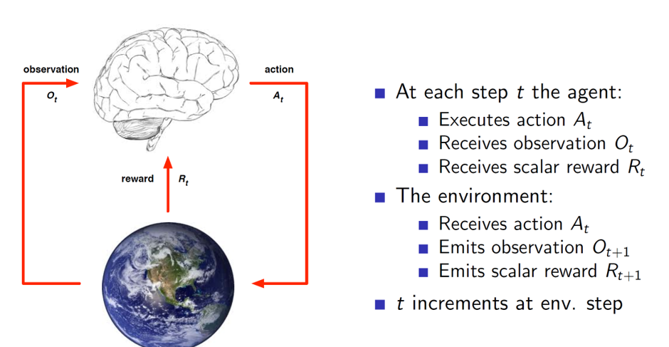

History and state:

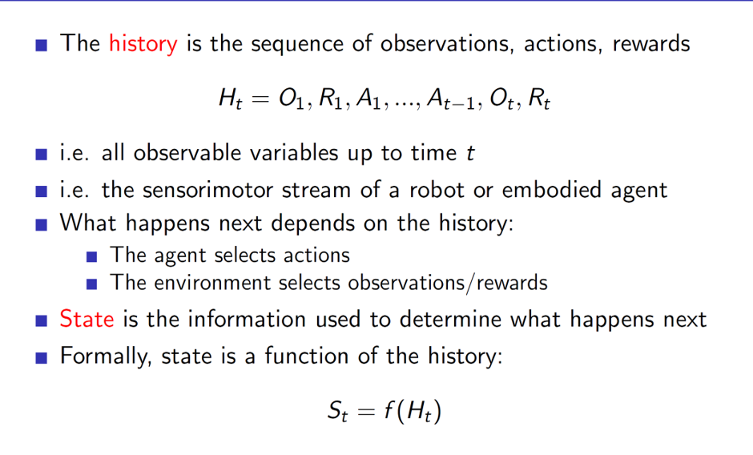

**Important: State is a function of history**

This means that the definition of state is dependent on the programmer.
A state may be defined as the last 4 observations, actions and rewards,
only the last observation, actions, rewards or the entire history or any
other combination which the programmer desires.

**Environment state:** Environment state is the environment's internal
representation. Depending on this, it will spit out the next observation
and reward to the agent.

**Agent state:** Agent state is the agent's internal representation.
This is used by the agent to pick the next action.

**Markov states:**

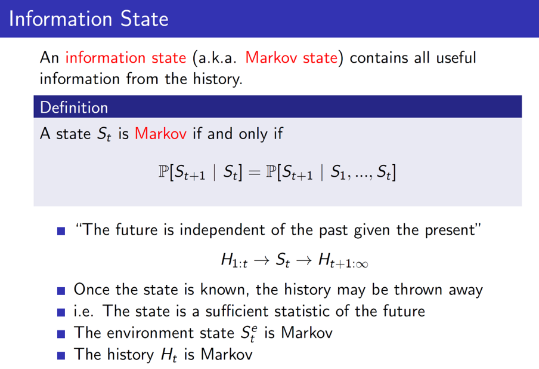

A state is a Markov state if and only if the next state can be
determined purely based on the present state. That is, to determine
S~t+1,~ only S~t~ is required, and any other previous states are not
required.

But note that here the definition of S is dependent on the programmer.
It could mean last 4 observations, rewards, actions or any other
combination.

Example:

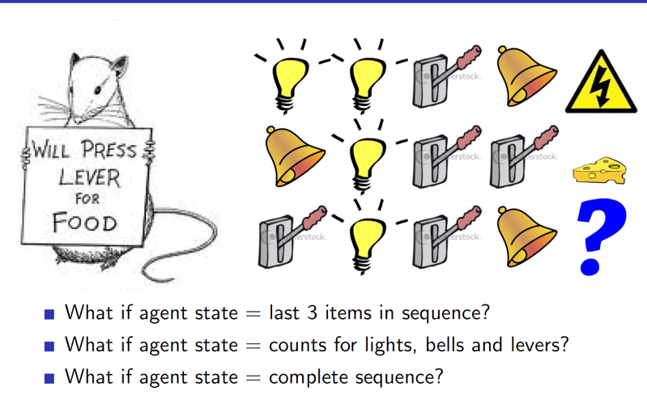

In the example we can see that depending on the definition of the state,
the predicted output may change.

Fully observable environments:

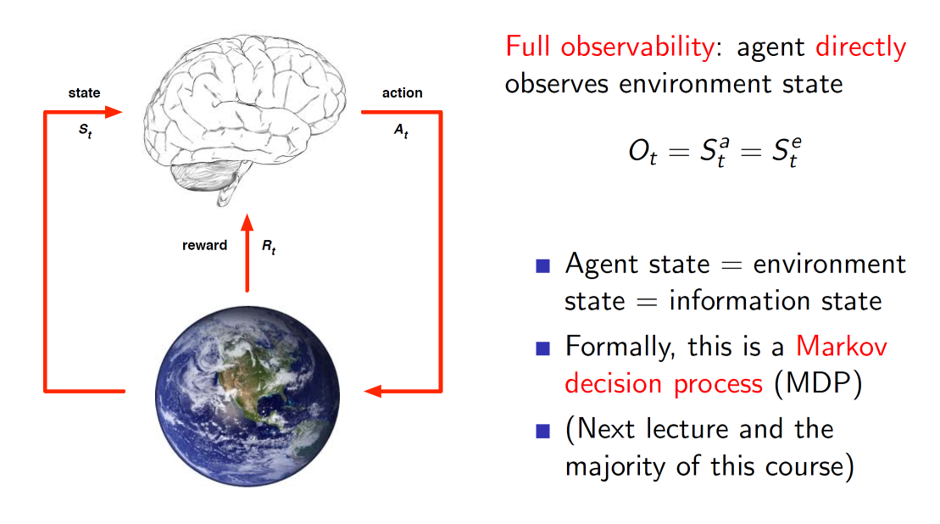

The environments which can be fully or directly observed by the agent
are called fully observable environments. Here, the agent has access to
the all the **relevant and required** information present in the
environment. Hence, the **agent state is same as environment state** in
this case.

Taking decisions in such an environment is called as Markov Decision
Process.

**Partially observable environments:**

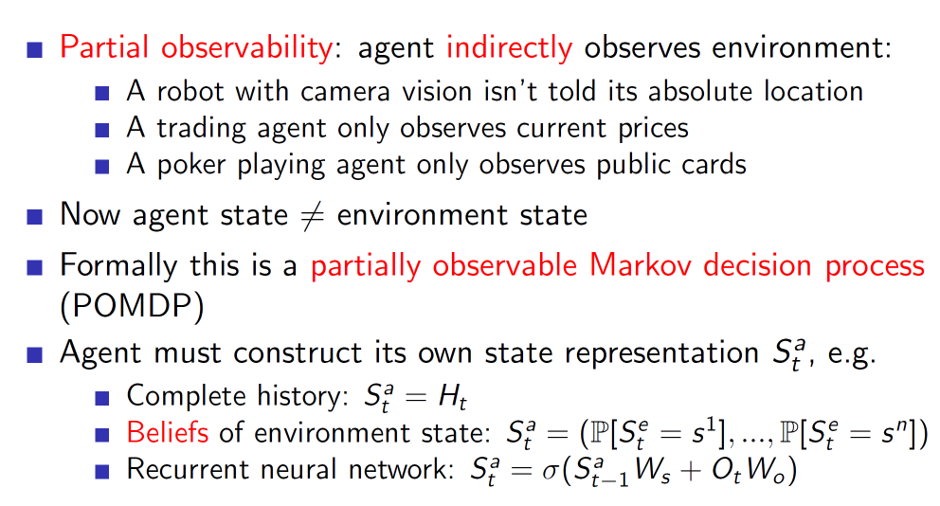

In partially observable environments, the agent won't have access to
entire required information. Hence, the environment state is
**different** from the agent state.

In such a case, the agents need to construct their own representations.
This can be done trivially by considering the entire history. Other
common ways are to use belief states, i.e probability of it being in
some state and choosing the one which is most probable.

Example: While playing poker, if we are able to count cards, we can
probabilistically determine the chance of different cards present in
different players' hands.

Another way is to use neural networks to predict the next state.

**Main components of RL agent:**

-   Policy: Agent's behaviour function.

-   Value: Goodness or badness of a state

-   Model: Agent's representation of the environment

**Policy:**

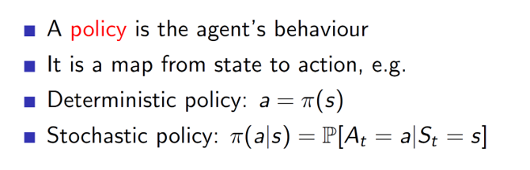

Policy can be deterministic, i.e it will ouput the exact action to take
or it can be stochastic; it outputs the probability of taking different
actions.

**Value:**

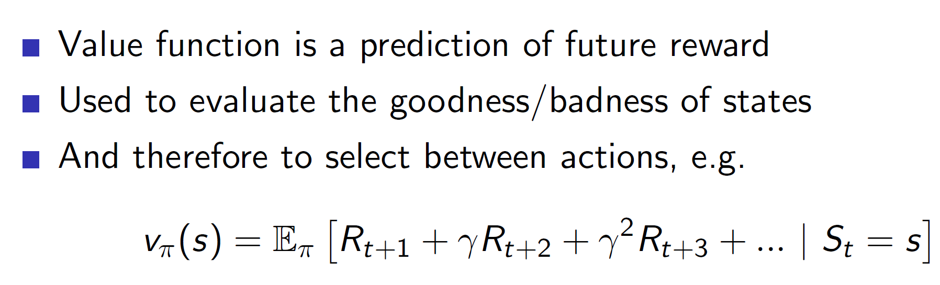

In value function, notice that the future rewards have a increasing
gamma parameter with it. It is basically used to reduce the impact of
the future rewards. That is, the rewards which are im../../images/rl/l1-dste are more
important than the rewards which are far away. Hence, the rewards which
are many time steps away should be given lesser importance as there is
more uncertainty. This is handled using the gamma parameter which is a
**value less than 1.**

**Model:**

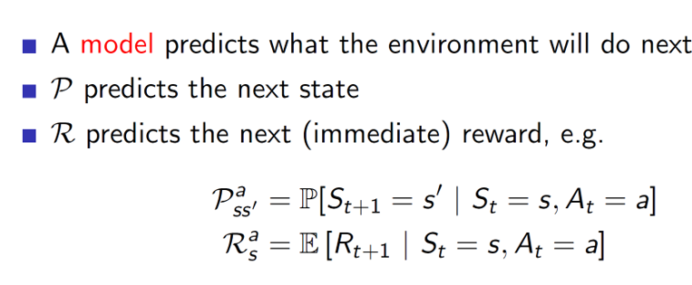

Example:

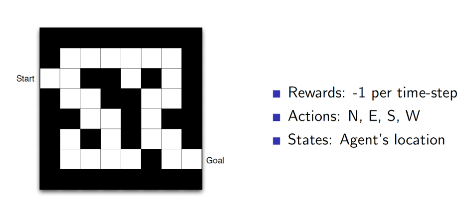

**Maze example using Policy alone:**

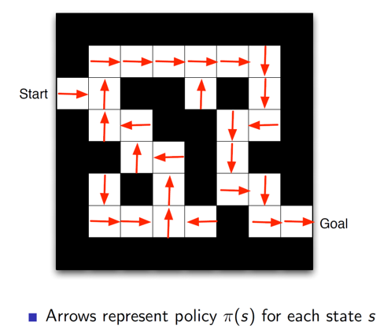

Here we can see that at each state the policy is showing the direction
in which the agent should move.

Maze example using value function:

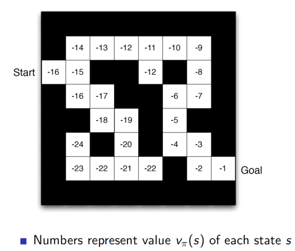

Here, at each state, the value function will show the goodness/badness
of the state. I.e, the start state is a bad possible state as it is far
away from the goal, hence a value of -16. Given such a value function,
we can choose which state to move to. In this example, we would move in
the direction which gives a higher value.

**Maze example based on model:**

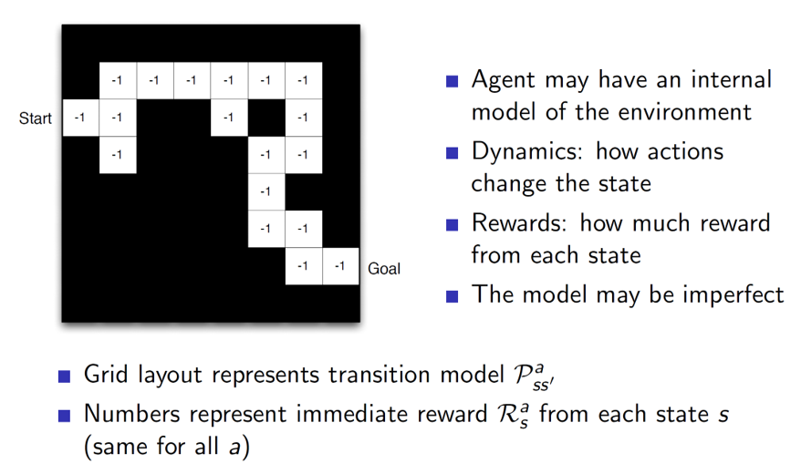

In case of model representation, every grid (state) is showing the
reward **for that state alone.** The model will use this reward to
calculate the cumulative reward and take actions accordingly.

**Categorization of RL agents:**

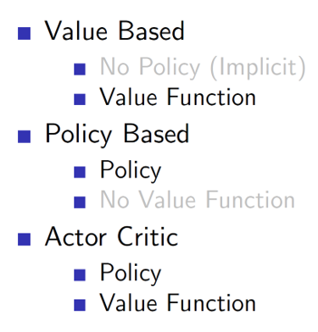

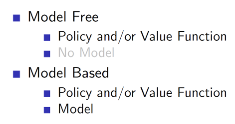

**Exploration vs Exploitation:**

There is an important trade-off between exploration and exploitation. If
the agent is to use the current available knowledge to make a decision
it is known as exploitation but then the agent will never discover new
things and get even higher rewards.

Example: If we always go to restaurants, we know then even though we are
getting good, scrumptious food, but trying out new restaurants may lead
to finding dishes which are even more delicious.
