*****
**Lecture Details**
* **Title:** Markov Processes
* **Description:** The lecture notes are based on David Silver's lecture video. 
* **Video link:** [RL Course by David Silver - Lecture 3](https://www.youtube.com/playlist?list=PLbPhAbAhvjUyrKlhnLEMyNmiF72ABB3Zh){:target="_blank"}
* **Lecture Slides:**  [Slides](http://www0.cs.ucl.ac.uk/staff/d.silver/web/Teaching.html){:target="_blank"}

*****
**Dynamic programming:** Dynamic programming implies that there is a
sequential or a temporal component to the problem. The general idea is
to break down the large complex problem into **smaller ones, solve the
smaller problems, combine them to get the solution of the larger
problem.**

**Principle of optimality:** Principle of optimality states that,
optimal solution of some large complex problem can be broken down into
smaller subproblems. By then finding the optimal solution to these
subproblems we get the optimal solution to the larger problems.

**Example:** Image we want to go to go from one end of the class to
another. This problem can be broken into two steps.

1.  Going from one end to the middle

2.  Going from middle to the other end

The optimal solutions to these sub problems will lead to the optimal
solution to the entire problem.

**Another advantage: Overlapping subproblems**

Different high-level complex problems can have some same subproblems.
This is advantageous as we can cache the solutions to these subproblems
and use them later for other problems.

**Example:** Consider going from some other end to some end of the class
(i.e if initially, it was A to B, now let it be C to D). We can again
break this into 2 steps. Now, it may happen that going from point C to
middle turned out to be the same subproblem as going from point A to
middle.

These properties are satisfied by MDPs and hence, we can use DP to solve
MDPs.

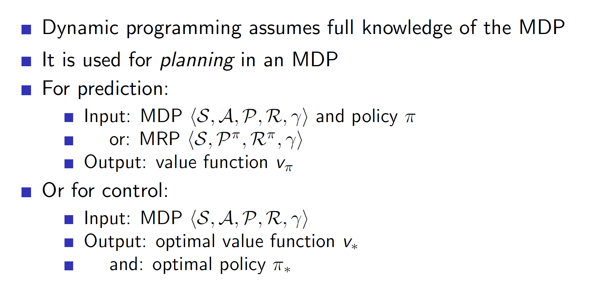

Dynamic Programming is used for **planning** in an MDP. There are two
use cases: 1. We use it predict a value function dependent on policy pi,
another we use it to find the optimal policy (control).

**Iterative policy evaluation:**

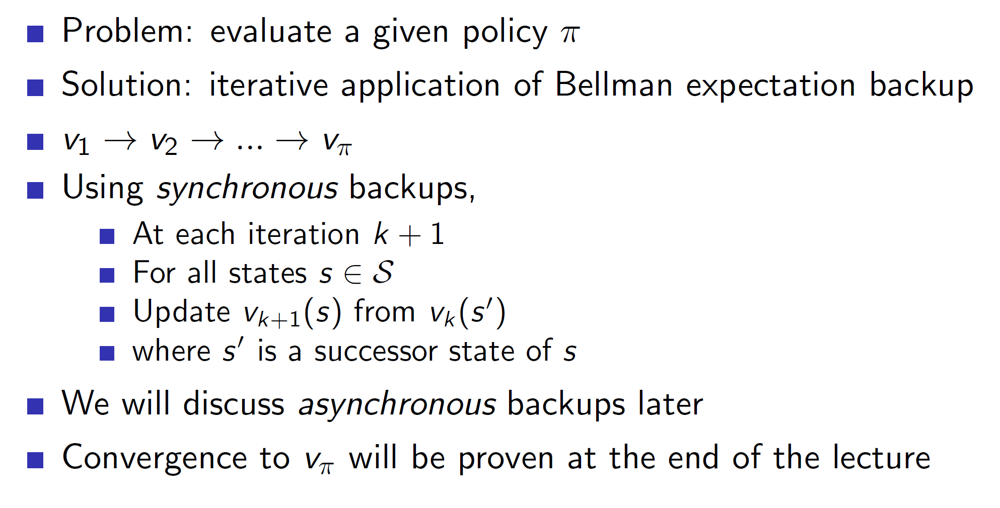

In Iterative policy evaluation, we use Bellman’s **expectation**
equation.

Bellman’s expectation equation is as follows:

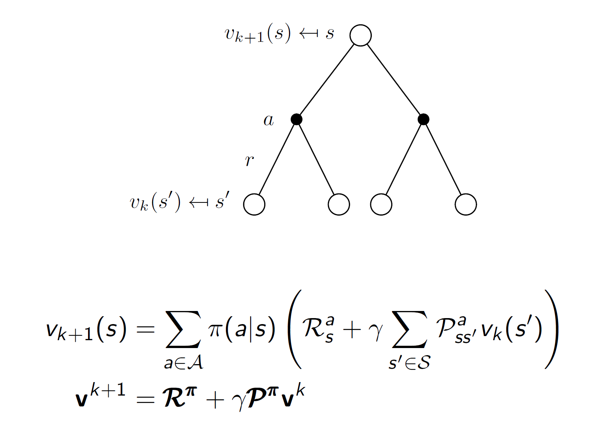

**Example: Small grid world**

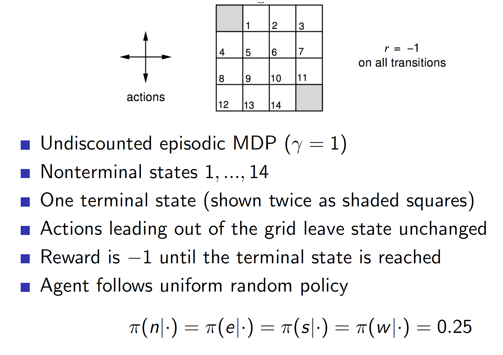

The two states shown in gray are the terminal states. The policy used is
a uniform random policy. That is, each action has a 25% chance of being
selected.

So, we are going to iteratively apply the Bellman’s expectation equation
as follows:

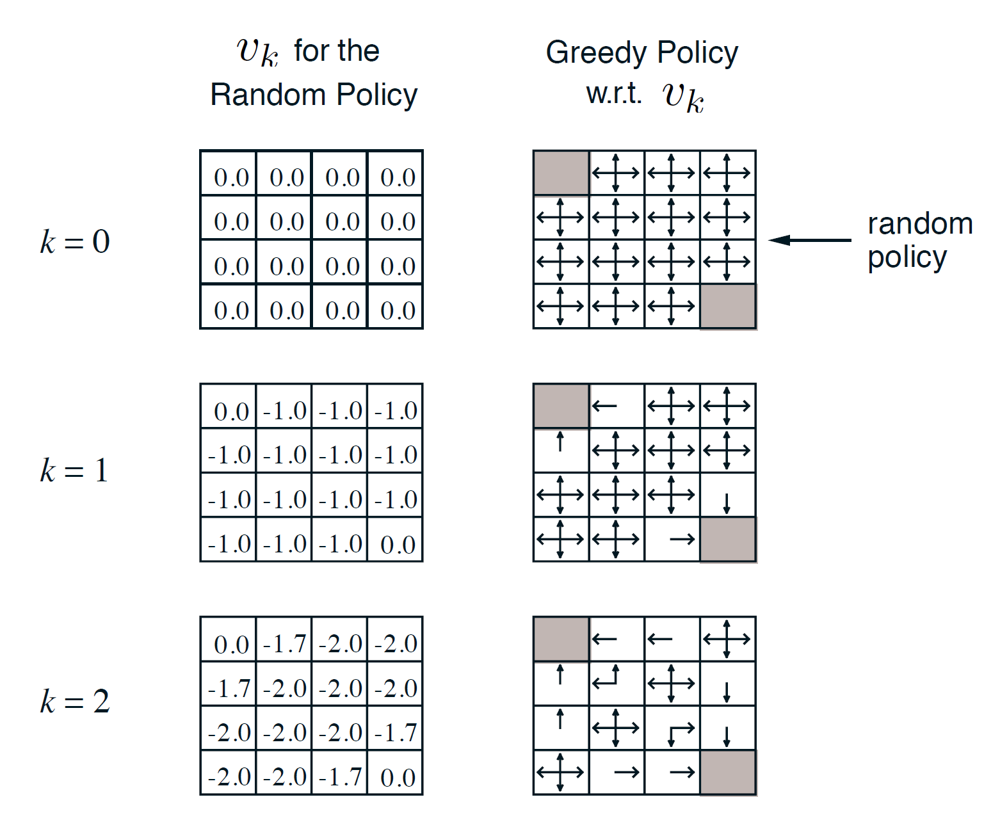

Here k = 0 represents the initial values of each state. We can
initialize it randomly or start at 0. So, initially we can see that the
policy matrix shows arrows in all direction because right now we don’t
have any knowledge.

In k = 1, we update the values of each state. We have defined the reward
of going from one state to another (until the terminal is reached) as
-1. So, now we are performing **one-step look ahead.** Taking one step
from any step other than the terminal will give a reward of -1, hence
all states other than the terminal get a value of -1. Now, the policy
function is being updated **greedily**. That is, we move the arrow
towards the state **which maximizes the immediate reward (one-step look
ahead)**. Hence, the immediate neighbors of the terminal states now get
a distinct value (left arrow, right arrow etc with 1.0 probability).

In k = 2, we update it again. Remember the equation is:

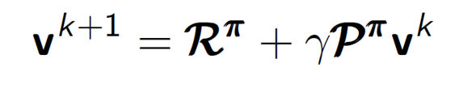

Consider, state(0, 1) = one in 0th row and the 1st
column (i.e with value -1.7).

This state has a value of -1.7 because it got updated as follows:

In the equation mentioned above, Rpi = -1 and gamma = 1. Here
Ppi is a transition probability matrix. As there is a 75%
chance of going into a state with value as -1, (look to the right and
below **for k = 1 and also consider the one above (north) as there is no
state in north, we end up back in the same state (as per the rules of
the game) and hence, we are ending up in a state with value -1 (as the
value of current state is -1)**) and a 25% chance of going into a state
with value 0.

**Hence, we have:**

\= -1 + 1.0(0.75\*-1 + 0.25\*0)

\= -1 – 0.75 = -1.75

Continuing this process,

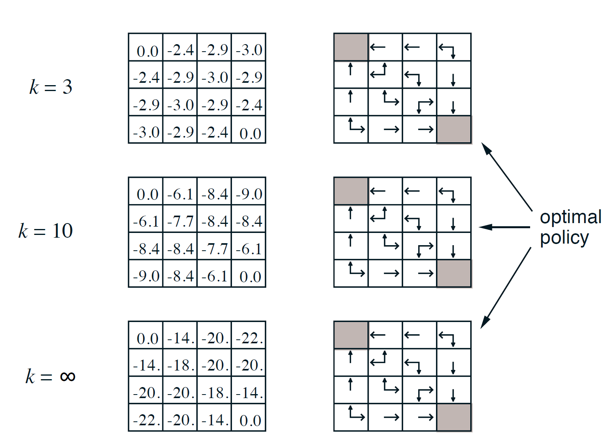

**Notice that the optimal policy was obtained at k = 3 itself. However,
the value functions got updated till they stopped changing by a
significant amount.**

**How is the policy improved?** 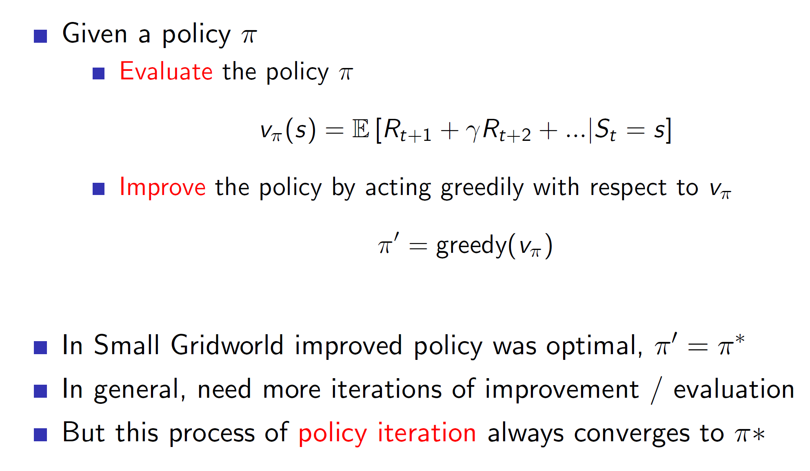

Policy is improved by iteratively evaluating a policy and then improving
it **greedily**.

In the small grid world problem, at every iteration we were updating the
policy by making the arrow point in the direction of maximum nearest
neighbor. This is called greedy update.

The idea can be visualized as follows:

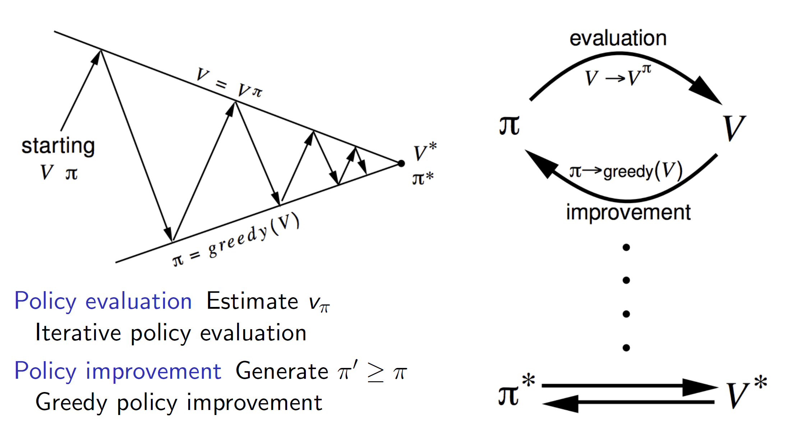

**It is guaranteed that this iterative process will always lead to an
optimal policy eventually.**

**Proof of convergence: Why does it converges to an optimal policy?**

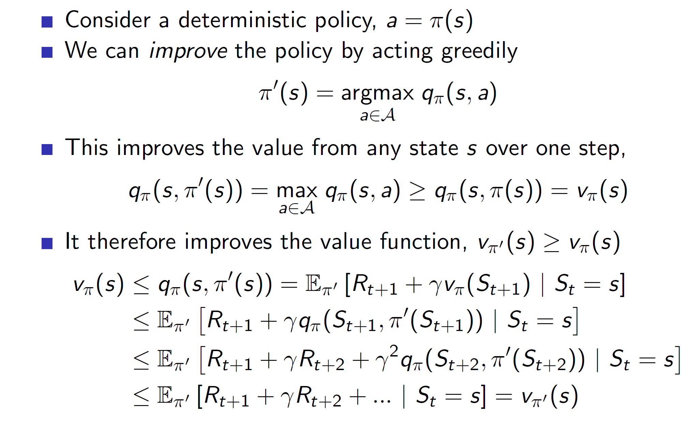

Basically, acting greedily is defined as choosing an action which
maximizes the action-value function (i.e argmax qpi(s, a))

Intuitively, making such a choose will always guarantee that the new
policy will be at least be as good was the old one. (See point number
3).

qpi(s, pi’(s)) implies that from a state s, we are choosing a
new policy (improved one) by selecting the best action greedily.
(Remember our grid world example where we choose the action based on the
highest value obtained by the immediate neighbor).

Hence, the new state value function will also improve as value function
is nothing but the max of action-value function. (point 4)

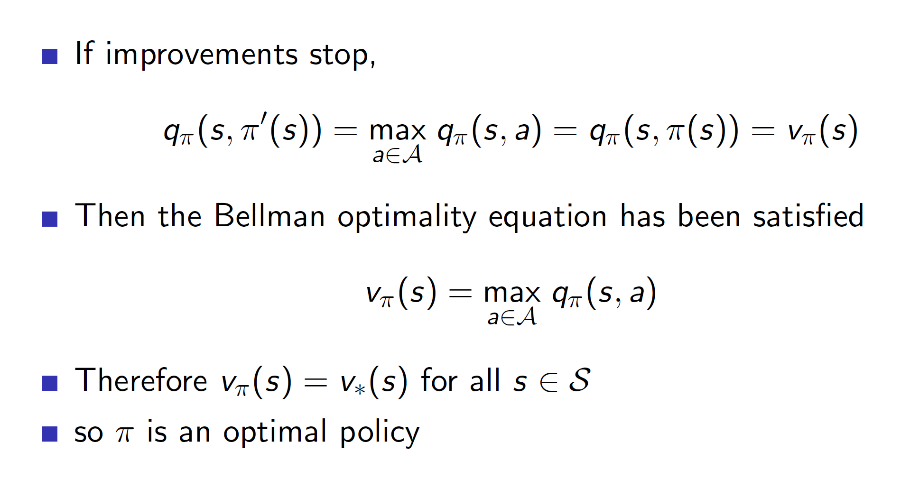

We do this till the improvements stop, i.e they converge. Hence, proved
that the iterative policy evaluation leads to convergence.

**Modified policy iteration:**

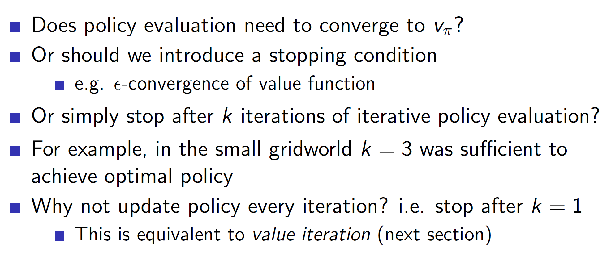

In our grid world problem, we saw that the optimal policy was obtained
at k = 3 itself but the algorithm kept iterating for a large number of
steps. This is unnecessary and inefficient. Modified policy iteration
provides improvements like early stopping, choosing maximum iterations
ourselves etc.

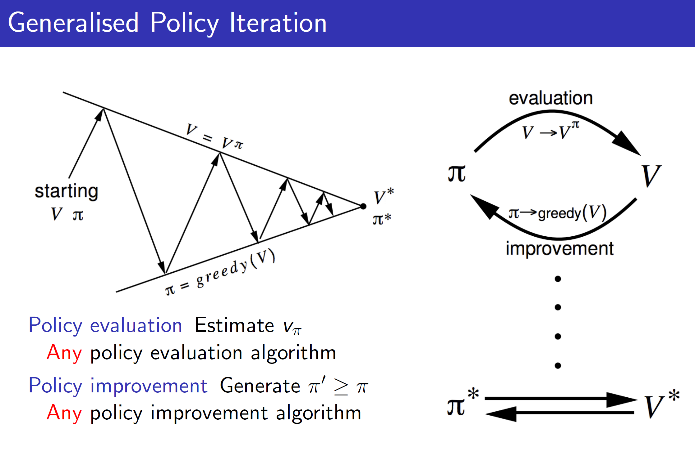

Here notice the **any in red.** The original policy iteration algorithm
used iterative evaluation and greedy improvement. But it is not
necessary to confine ourselves to those.

**Formal definition of Principle of Optimality:**

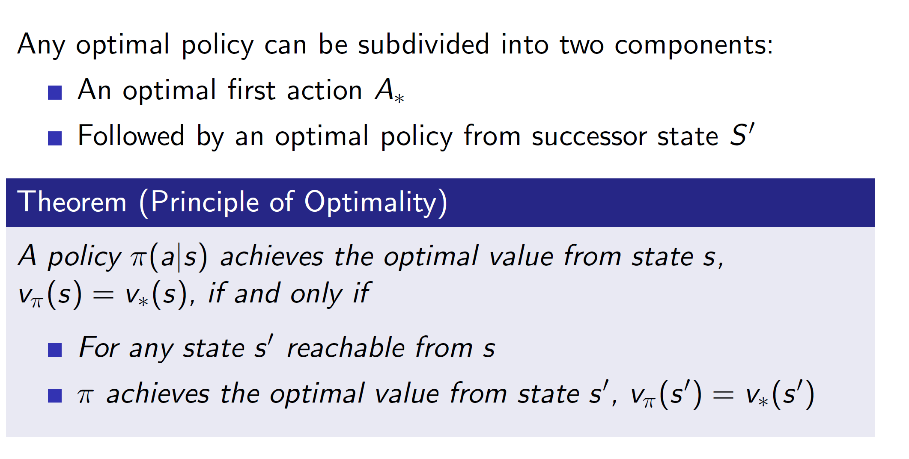

Basically, optimal policy from some state s is only achievable if it is
possible to achieve optimal policy from any state s’ which is a
reachable from s.

**Deterministic Value Iteration:**

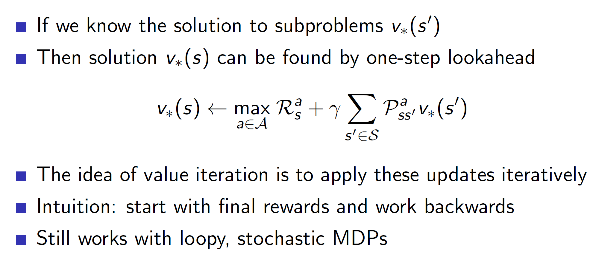

In value iteration, we are basically backtracking to get the optimal
value function. We start with the final rewards and work backwards.

**Note: In Value Iteration, we are using the Bellman Optimality
Equation.**

Here, we are assuming that we know the answer to v\*(s’).
While moving backwards, the reward of the final states can be easily
determined, hence it works.

**Example problem: Shortest path**

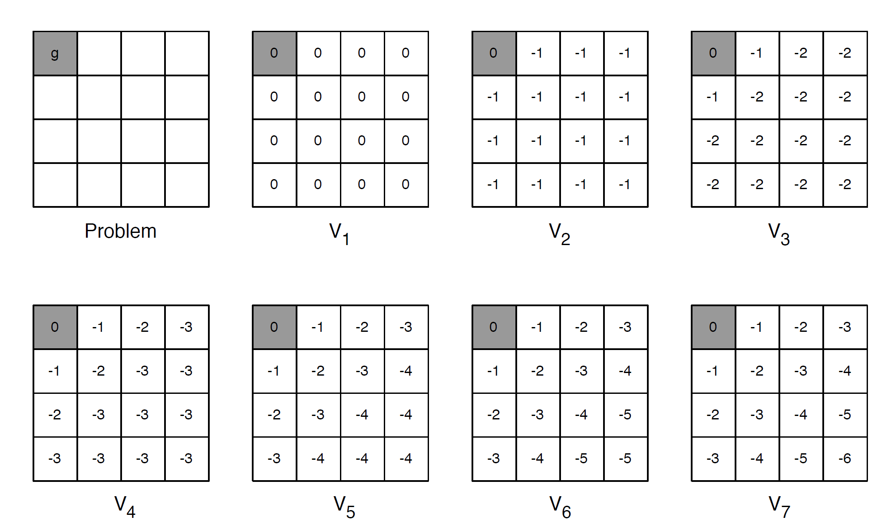

Here, the gray state is the goal state. Now, we start with **the final
reward and then backtrack**. Here, the final reward is 0 (for goal
state) – The problem is of finding the shortest path from any state to
goal state and we assuming moving from one state to another gets a
reward of -1. Therefore, shortest path from goal state to itself is 0.

All other values are initialized to zero in the first iteration.

In the second iteration (V2), everything gets updated to -1. Remember,
we are doing one-step lookahead (or one-step looking backwards). So,
basically, the equation which we have is:

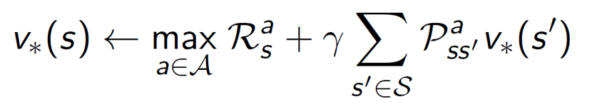

For second iteration (V2), consider state(0, 1).

We have: -1 + 1.0\*(1.0 \*0) = -1

Here, max reward will be -1, gamma = 1.0 and wherever we move we end up
in a state with value = 0 (check the V1 matrix), hence, the probability
of ending up in 0 is 100%. (1.0\*value).

For third iteration (V3), consider state(0, 2)

We have: -1 + 1.0(1.0\*-1) = -1 -1 = -2

Similarly, over here, we always end up in state with value -1 from
state(0,2). Hence, probability = -1. We get a total value of -2.

Notice that in V3, we aren’t updating the states (0, 1) and states(1,
0). This is because the shortest path to the goal state has already been
found.

**Value Iteration algorithm:**

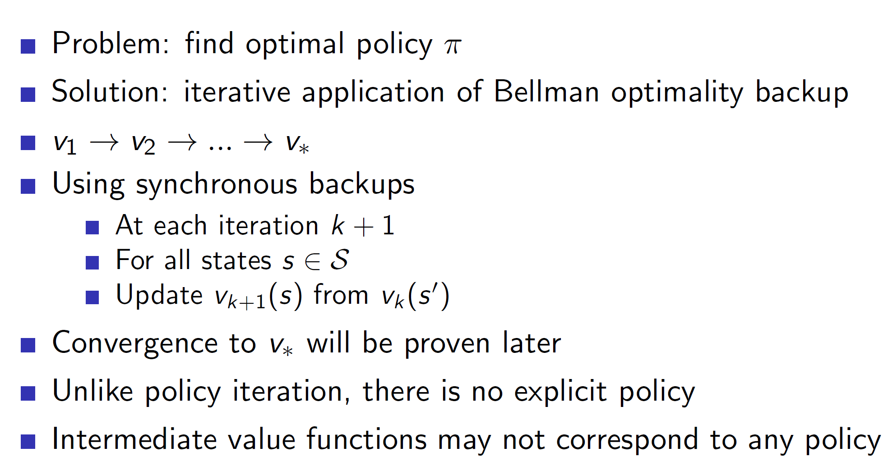

Notice that in Value Iteration we are finding the **optimal** policy pi
while in Iterative policy evaluation we were **evaluating some policy**
pi. In Value Iteration, we don’t need to switch from value to policy
matrix. That is, remember the following diagram:

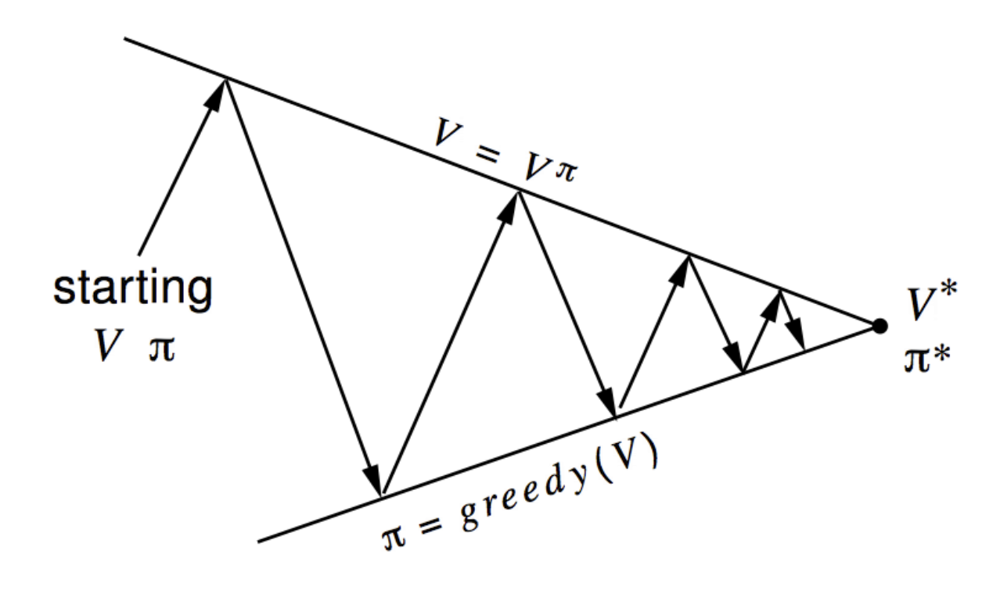

That diagram is for policy iteration not value iteration. In value
iteration we are simply going through the different value matrices,
**i.e there is not explicit policy in value iteration.**

Value iteration can be shown with the following formula:

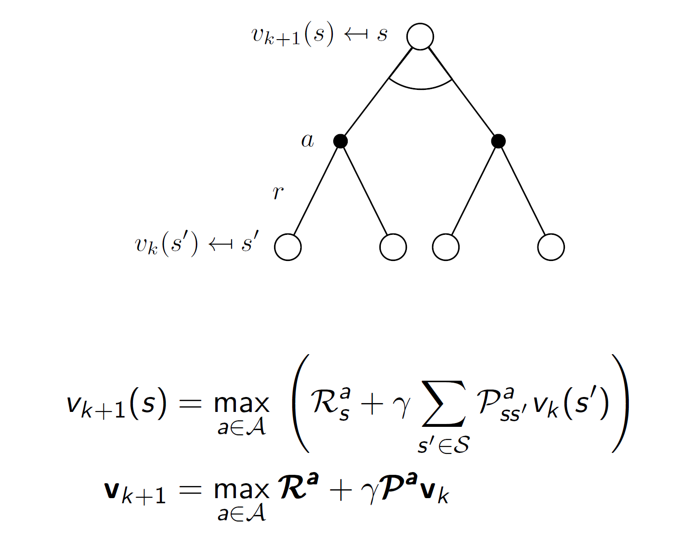

**Overview of synchronous dynamic programming algorithms:**

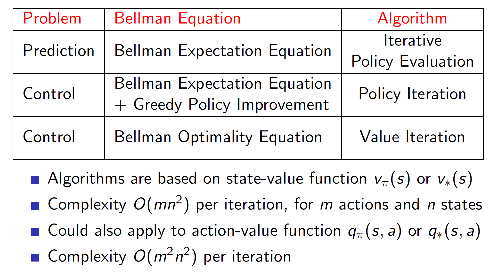

The algorithms which we studied till now are called synchronous backups
because **all the states** are being updated at the same time. This only
works for a considerably small number of states (around a million
states). But for problems with extremely large state space, synchronous
algorithms will be too inefficient. In such scenarios we use
asynchronous algorithms.

**Asynchronous DP:**

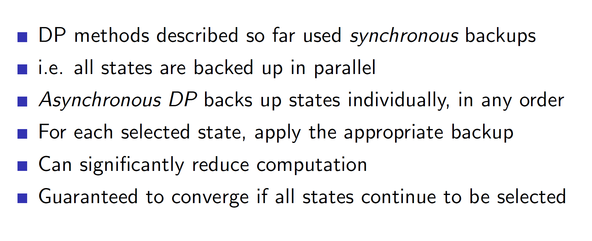

**Note that, asynchronous DP too is guaranteed to converge as long as
all states are continued being selected.**

**Types of asynchronous DP:**

**In-place dynamic programming:**

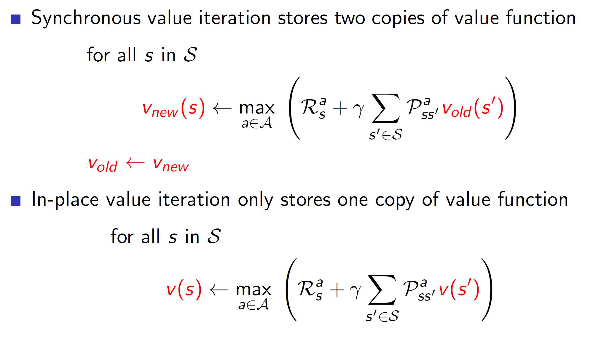

In-place dynamic programming only stores a single copy of value
function. This would reduce the number of states to be maintained by
half. This works because we are doing asynchronous backup. Basically, we
would be updating the state values directly in the original input
itself. Hence, a single copy suffices to correctly generate the values.

**Example:** Say there are 1 billion states. If the previous and current
copy is maintained then we would need to store 2 billion states in
total. In case of in-place iteration, we only need to store the present
1 billion states.

**Prioritized sweeping:**

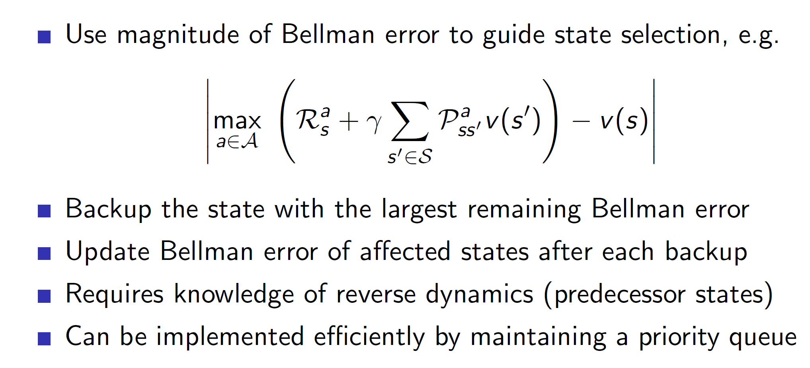

In prioritized sweeping, the idea is to update those states first which
are performing the worst, i.e the ones with the worst Bellman error.
That is, we prioritize updating those states first which change the
most.

Real-time DP:

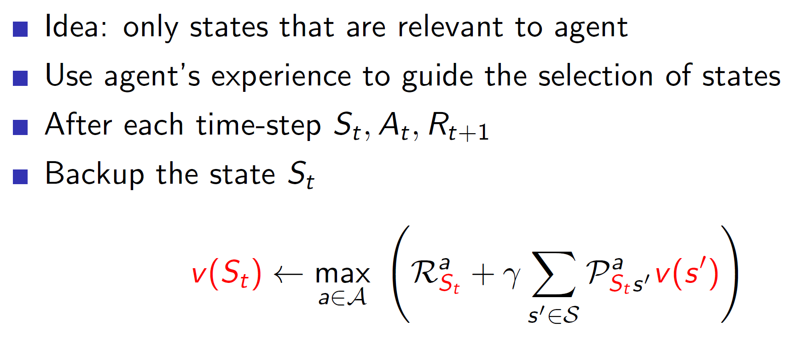

Basically, we update those states which are relevant to the agent’s
result. For example, consider that an agent is in a room and wants to
dance. The act of dancing requires the agent to be in states near the
middle of the room only. The agent won’t be required to go to the end of
the room and thus, we can eliminate those states.

**Full-width backups:**

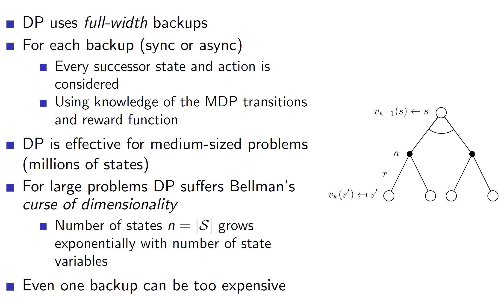

Dynamic programming considers every single action and state all the
time. As we have talked before, this is expensive and many times
impossible to deal with.

**Solution: Sample backups**

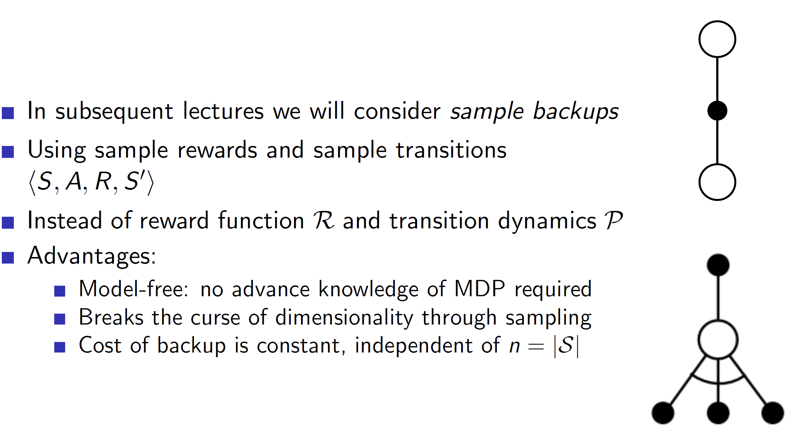

In sample backups, we are only considering a small part of the tree
instead of the whole tree. This increases the efficiency.
