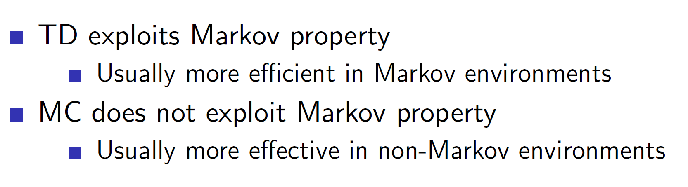
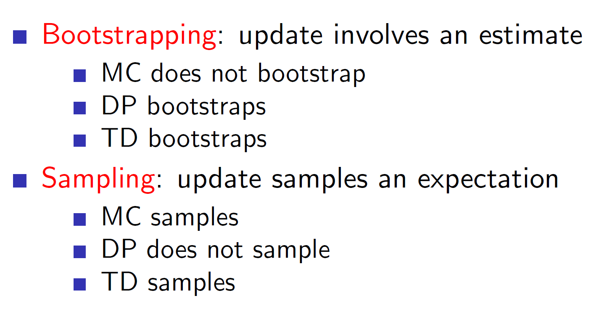

****
**Lecture Details**
* **Title:** Model Free Techniques - Monte Carlo and Temporal Difference
* **Description:** The lecture notes are based on David Silver's lecture video. 
* **Video link:** [RL Course by David Silver - Lecture 4](https://www.youtube.com/playlist?list=PLbPhAbAhvjUyrKlhnLEMyNmiF72ABB3Zh){:target="_blank"}
* **Lecture Slides:**  [Slides](http://www0.cs.ucl.ac.uk/staff/d.silver/web/Teaching.html){:target="_blank"}

**Credits: All images used in this post are courtesy of David Silver** 

*****

**Model-free reinforcement learning:**

In model free techniques, the model of the environment is not known.
**Hence, we have no knowledge about the MDP’s transitions/rewards.**
Such an environment is closer to what actual complex problems will have.

Hence, we are trying to solve an **unknown** MDP.

**Monte-Carlo Reinforcement Learning:**

In Monte-Carlo, the agent learns through episodes. Episodes are one
complete sample of the environment. That is, going through some states
which eventually **leads to a terminating state**. Hence, Monte-Carlo
methods learn from **complete (terminating)** episodes only.

To get the value of different states ,we simply calculate the mean
returns at the **end of episode.**

**Policy Evaluation using Monte Carlo:**

One important point in MC policy evaluation is that **we don’t calculate
the estimated return. We are calculating the actual (empirical) mean
return.**

**Types of Monte-Carlo:**

**First-visit Monte-Carlo:**

For **every** episode, we update the state s only the **first** time. We
do so by incrementing the counter and the total return. Also note that
Gt is the empirical (actual) reward in this case. This would
be obtained by visiting some sample of states in that episode.

It means that if the same state s is encountered multiple times in the
same episode then we won’t be updating it. Example: If we go left, then
go right again we would end up in the same state but it won’t be updated
the second time.

Again, note that this will be done for many episodes and the values of
counter, total return etc will persist across the different episodes.

**Every-visit Monte Carlo:**

In every-visit Monte Carlo, the state s is updated every time it is
visited in the same episode.

Monte Carlo Black Jack example:

Consider, the simplified version of Black Jack. Here, we are defining
two actions – stick and twist. The reward function is also defined by
us. Notice that there is no probability transition matrix as we do not
know the working of the environment.

For simplicity, we are only taking an action if our current sum is
between 12 or 21 otherwise, we are automatically twisting if sum of
cards \< 12 (because there is no point in sticking and showing hand if
sum is small). We are also considering whether we have a usable ace or
not and looking whether the dealer’s current card is an ace or not.
**(Note: Usable Ace can take a value of 11)**

The value function after Monte Carlo learning can be seen in the diagram
shown above. We can see that the eventually after 500 episodes the graph
peaks at player sum = 21 (i.e it gives a reward of +1) and it is flat in
other regions.

**Incremental Mean:**

We can rewrite the mean as shown below:

That is, mean of k points can be written as mean of k-1 points + the
difference between present point (k) and the previous mean.

More intuitively, we are expecting the value xk to be near
uk-1, so Xk – Uk-1 can be thought of as the error or
difference between the estimate. If it is completely same, then the
Uk = Uk-1 otherwise it will change based on the
error difference.

The incremental mean can be used to rewrite the value function update in
MC. Then we can replace 1/N(St) with alpha. This alpha helps
us change the equation to an exponential decay form where we can control
how much of the old episodes we want to remember.

**Temporal Difference Learning:**

The main difference between Monte Carlo method and TD methods is that in
TD the **update is done while the episode is ongoing.** That is, we can
learn from incomplete episodes. **This is done by estimating the
remainder rewards instead of actually getting them. This idea is called
bootstrapping.**

Example: Consider the exit door of a classroom is the end state. In
Monte-Carlo, all episodes must end with this state and the states would
be updated only when the episode has ended. In TD Learning, we may
travel halfway through the classroom and estimate the reward for the
remainder distance.

As we can see, in temporal difference learning, Rt+1 is the
actual reward which we get at time step t, and the
gamma\*V(St+1) is the **estimated future reward.**

**Driving Home Example:**

Consider the driving from office to home example. Here, we are
travelling from office to home and there are 6 states. As we can see,
the predicted time estimate changes with every state; that is we are
updating the estimate while running through the episode.

In Monte Carlo, we can only update after the end of the episode. So, we
wait till the episode has ended (arrive home state reached) before
updating the state value estimates. In case of temporal difference
learning we can update after every state. That is, after leaving the
leaving office state we can immediately update our value estimates based
on the rewards we got till now.

**Advantages and Disadvantages of MC and TD:**

**Bias/Variance trade-off:**

As the returns in Monte Carlo are actual returns, they are completely
unbiased. That is, they are true values obtained from the environment.
However, this means that it has high variance as it will be a perfect
return (returns will include any noise/outlier obtained during the
episodes).

On the other hand, the TD estimate is a rough expectation and hence it
will be biased. As it’s an approximate estimate it will have low
variance.

Therefore:

**TD – high bias, low variance**

**MC – zero bias, high variance**

**Advantages/Disadvantages continued:**

Here, function approximation is the idea of approximating the value
functions instead of calculating them as it is very time consuming to
actually calculate value functions for complex problems.

**Random-walk example:**

To compare MC and TD, consider a scenario where we select the same
sample episode k and run both MC and TD(0) (Here 0 specifies that update
will be done at every time step).

Consider the above sample episode. Here, as there are 8 instances of B,
6 1s and 2 0s, we can say that V(B) for both MC and TD will be 6/8.

TD would form an implicit MDP as follows:

For TD, we will use the update rule: 
R(T) + gamma * V(St+1)  = 0 + 1*(6/8) = 0.75  
For MC, the only observation was V(A) = 0, hence V(A) = 0. To put it more concretely, see
the image below:

Here, we can see that as MC minimizes the mean squared error,
V(St) will take a value of 0. As Gt -
V(St) will be minimal when V(St) is 0 (Because A =
0).

On the other hand, TD(0) converges to max likelihood of Markov Model.
Notice the 1 in the double summations. It is an indicative function
which indicates that the transition from s to s’ actually exists.

So here, V(A) will be 0 + 1 + 1 + 1 + 1 + 1 + 1 + 0 = 6/8 as we are
basically, calculating the transition in each episode. (Remember it’s
based on the equation Rt+1 + gamma\*V(St+1).

**Backups:**

**Monte-Carlo Backup:**

In Monte-Carlo we are basically traversing one random path of states
which eventually leads to a terminating state. Hence, it will traverse
through the **depth** and end with a terminating state.

**TD Backup:**

In TD, we only look one step ahead and then estimate the rest. That is
Rt+1 + gamma\*(V(St+1).

**Dynamic programming backup:**

In DP, we used to consider **all possible states** one level ahead, i.e
the entire breadth of level+1.

As opposed to this, in MC and TD we are only considering a limited
space.

Summary:

Remember that bootstrapping is estimating the future rewards.

**Unified view of RL:**

As we can see, TD Learning has shallow backups while Montel Carlo has
deep backups (it goes all the way till the terminating state).

Using TD(lambda) we can adjust this level of backups as per our need.

Instead of looking ahead by 1-step we can look ahead by any arbitrary n
steps.

**N-step return:**

Now, in n-step TD we would be updating the value function after n-steps.
(that is, we would be backing up after n steps). Hence, the reward
return Gt can be rewritten as shown above.

**Averaging n-step returns:**

Instead of selecting a fixed value of n (we can’t decisively decide the
best value of n), it’s better to average these returns. For example, we
can decide to calculate 2-step return and 4-step return and then average
them together to update the value of the value function.

**Lambda return:**

Just like this, we can get the information for all n steps, i.e 1 step,
2 step, 3 step etc using lambda return. We write the lambda in the form
of geometric series. Writing it in the form of geometric series is
computationally efficient and will allow us to solve it for nearly the
same time as TD(0).

It is a decaying function; hence, the larger steps are given smaller
weightage.

**Forward-view TD(lambda)**

One disadvantage of TD(lambda) is that we need to wait till the end of
the episode to perform any update. This is because we are considering
all time steps n, where (nth step = last time step) and hence, the
update would only be performed at the end of the episode like MC.

This can be solved using Backward pass using eligibility traces.

**Backward pass: Eligibility traces**

Consider the three bell, one light, shock scenario. Did the shock happen
because the bell rang three times or because of the light? It depends on
whether we are giving importance to frequency of occurrence or recency
of occurrence. Eligibility traces combines both these heuristics.
Everytime a state is visited, the value of the trace is increased,
otherwise it will start decaying.

So, basically we will be updating every state with the information
obtained till now in the form of eligibility traces.

The original equation was V(S) + alpha\*(St), now we include
the eligibility trace to it.

Hence, we don’t need to wait till the end of the episode to update. We
can keep updating at every time step.

When lambda = 0, the eligibility trace will always be 1, as we will
always be in the same state. Hence, the update will be same as TD(0).

Note that we are talking about the following lambda:

**TD(lambda) and MC:**

Another interesting property is that TD(1) will have the same total
update as MC.

**(Refer to PPT for proof)**
