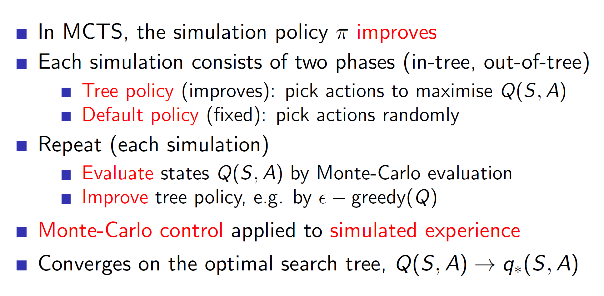

*****
**Lecture Details**
* **Title:** Integrating Learning and Planning 
* **Description:** The lecture notes are based on David Silver's lecture video. 
* **Video link:** [RL Course by David Silver - Lecture 8](https://www.youtube.com/playlist?list=PLbPhAbAhvjUyrKlhnLEMyNmiF72ABB3Zh){:target="_blank"}
* **Lecture Slides:**  [Slides](http://www0.cs.ucl.ac.uk/staff/d.silver/web/Teaching.html){:target="_blank"}

**Credits: All images used in this post are courtesy of David Silver** 

*****

Till now, we have learned the policy/value directly from the experience.
But it is also possible to learn the model of the environment from the
experience. Such a model helps in planning. This planning helps
construct a value/policy function.

**Model Based RL:**

In model based RL, we have a simulated representation of the
environment. This simulated representation can be used for planning
future actions. **Basically, a model based RL agent will learn the
probability transition matrix and the rewards i.e it will learn the
MDP.**

**Advantages and Disadvantages of Model Based RL:**

The model of the environment is learned by understanding from the real
world experiences. That is, the agent first works in the real-world,
gets some **real-world experience (S, A, R, P)** and uses these tuples
to build the model. So, this is a supervised learning problem and hence,
any supervised learning technique can be used.

Because we know what we know about the environment, that is, our model
is our knowledge about the environment, we also know the things we are
uncertain about and hence, we can handle uncertainty better.

**Disadvantages:** Here, we are performing a two-step process. First we
are learning a model and then learning the value/policy as opposed to
the previous model-free techniques where we only learned the
value/policy. Hence, the approximation error increases.

**Formal definition of a model:**

So, a model is a representation of an MDP (S, A, P, R). That is, given a
state St and action At, the model can estimate the
next state St+1 and the reward Rt+1.

**Note:** Here we are assuming that the state space S and action space A
are known. But in more convoluted problems, it is possible that this is
not the case and the state/action space would also need to be estimated.

**Why even do model based RL?**

Consider a maze game where a new maze is formed each new episode. A
model free agent will have extreme difficulty navigating the environment
as it won’t be able to learn the value functions properly (as the maze
changes every episode). On the other hand, the model based agent can
simply learn the rules of the game, i.e going up makes me go north,
going left makes me go west etc. By learning such trivial rules, the
model based agent would be able to solve the maze much better.

**How to learn a model?**

As we previously saw, the model learning problem is a supervised
learning problem.

**Types of models which can be learned:**

There are endless possibilities of models which can be learned. It is up
to the programmer to choose the right model representation.

**Table lookup model:**

The simplest way to “learn” a model is by creating a table. The
probability transition matrix can be created by counting the transitions
actually experienced and dividing by total. Similarly, the rewards can
be the average of all rewards.

Example:

Consider the simple problem shown above. Here, the transition from state
A to state B is seen once (first tuple). Hence, the transition matrix
will show it with 100% probability. There are 8 B’s leading to a
terminal state, 6 of which get a reward of 1 and 2 of which get a reward
of 0. Hence, we can form a model which says that 6/8 (75%) of the times,
we get r = 1 and 25% (2/8) of the times we get r = 0.

**Problem of exploration:**

One evident issue with this idea is that if our real world experiences
aren’t a good representation of the environment then the model
constructed will have a heavy bias. That is, in our example, we have
only seen one experience (tuple) with state A. Based on that single
tuple, we learned a model which says that A -\> B has a 100% chance of
occurrence. But in reality, this is unlikely to be true and may simply
be a result of learning from too few real-world experiences. Hence, the
amount of exploration needs to be appropriately handled.

**Planning with a model:**

**Once we have a model representation, we can use this model to generate
new tuples (experiences) and learn from those experiences.** Hence, it’s
important to have a good simulated representation as we are learning
from the generated simulated experiences. This learning can be done
using any planning algorithm like value iteration, policy iteration etc.

**Sample based planning:**

The simplest approach is to use the model to generate new samples of
data and apply model-free RL algorithms like MC, SARSA to those samples.

**Example:**

Once we create the model shown above, we can use that model to generate
samples (sampled experiences) and **apply RL algorithms to those sampled
experiences.**

In this case, as samples A, 0, B, 1 was generated twice by the model,
the V(A) becomes 1 as starting in state A lead to a final reward of 1.
(**Note that we aren’t considering the real world experience A, 0, B,
0).** The real world experiences are only considered to create the model
and then the learning of value function is based on the sampled
experiences from the model.

**What if our model sucks?**

Again, a big problem is that the learned algorithm is only as good as
the model which we have learned. If the simulated environment
representation doesn’t represent the real-world dynamics well, then the
policy learned won’t be optimal. One way to solve this is to jettison
the idea of using model-based algorithm and another way is to use
sophisticated approaches like Deep Belief Networks which would weight
the model based on uncertainty.

**Integrated architectures:**

A more robust solution is to use both the real experience and simulated
experience. If used properly, the resulting agent performs better than
normal.

**DYNA:**

Dyna is an integrate architecture which learns the model from real
experience and does the planning of value function using **both** real
and simulated experience.

**Architecture:**

Here we can see that the value/policy part is formed using planning via
the learned model and directly via the real experiences.

**Algorithm: Dyna Q**

Basically, in Dyna we execute an action A in the real environment and
observe the reward R and state S'. The Q-value is updated using the
general Bellman’s equation. This (S, A, S’, R) tuple is also used to
improve the model. **Now, we again update the Q-value using the tuple
sampled from the model.**

Hence, in every iteration, the first update comes from real-world
experience and then n updates are from the samples generated from the
learned model.

**Interesting problems:**

Consider the environment shown above. Here the gray tiles represent a
wall and hence, the agent cannot travel through that space. Now, the
solution is to go all the way right from state S and go all the way up
(as per the first diagram). But say that we change the environment
mid-way. Now, if the agent follows the same solution it won’t get the
optimal reward. It will take a lot of time to find the new correct way.
This can be solved by an improved architecture called the Dyna Q+.
**Dyna Q+ rewards exploration.** Hence, in dynamic environments which
may change, algorithms like Dyna Q+ will perform better than Dyna Q.

The same is true even if the changed environment is easier. Dyna Q will
keep following the same previous path even though the new path is
shorter and better.

**Simulation-based search:**

Forward search algorithm **emphasises on the present state.** That is,
we don’t care about some random sample from any random state (as we have
seen till now) but we care about the sample starting from the present
state St. So, we are looking ahead from the present state
St. Now, this state St may be some intermediate
state. **That is fine, as just solving a sub-MDP we are still improving
our understanding and policy.**

**Simulated forward search:**

This idea of forward search can be executed by sampling from our learned
model. Then we can apply model free RL techniques to these simulated
episodes.

Formally,

Where k = episode

**Monte-Carlo search:**

Monte-Carlo search basically samples episodes from the model and
evaluates those using the MC algorithm. **Notice that, in simple
monte-carlo search we aren’t improving the simulation policy.**

**Monte-Carlo tree search:**

**In tree search, we build a search table for every state visited. In
case of simple Monte-Carlo we were only updating for the root state
St. **

The simulation policy is improved epsilon greedily. There might also be
states which we have never explored. The actions to such states can be
taken randomly.

**Example: Game of Go**

**Rules:**

In go, we essentially try to surround as much territory as possible.
Also, if we surround an opposite colored stone, that stone will be
eliminated. That is, if blacks surround a white stone, the white stone
gets eliminated.

**Evaluating the positions:**

**Notice that, max min vpi(s) says that the agent needs to
consider the optimal play (mini-max algorithm).**

**Applying forwards search:**

We can see that by simulating the outcomes starting from some current
position s, we can start approximating the value function. In the
example shown above, as 2 in 4 outcomes lead to a black victory our V(s)
will be 2/4 = 0.5.

**Tree evaluation**

Consider that we start by sampling some branch which lead to the black
winning (terminal state has reward 1). Hence, we write the root as 1/1.
(1 win in 1 episode)

Executing another sample:

Now, as the terminal state = 0, we write ½ in the root and 0/1in its
child. Notice that we are slowly building the tree.

Executing another sample:

Now, we explore another branch and black wins. So, we update the values
at the explored nodes.

This way we keep adding new information to the tree policy and go in the
direction of the best branch. That is, the tree policy will choose the
likely branch (epsilon greedily) and hence, we will follow the best
known path. Once we are out of the tree policy domain, we choose the
actions using some default policy.

**Advantages of MC:**

**TD search:**

Instead of MC, it is also possible to use TD search and use the idea of
TD for tree evaluation etc.

Formally,

**Dyna-2 architecture:**

