*****
**Lecture Details**
* **Title:** Advanced Exploration 
* **Description:** The lecture notes are based on David Silver's lecture video. 
* **Video link:** [RL Course by David Silver - Lecture 9](https://www.youtube.com/playlist?list=PLbPhAbAhvjUyrKlhnLEMyNmiF72ABB3Zh){:target="_blank"}
* **Lecture Slides:**  [Slides](http://www0.cs.ucl.ac.uk/staff/d.silver/web/Teaching.html){:target="_blank"}

**Credits: All images used in this post are courtesy of David Silver** 

*****

We have already studied the importance of exploration. In brief, the
idea is to try out new things in the hope of getting more reward.

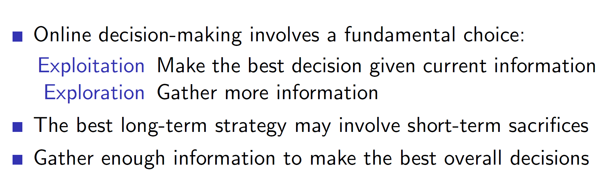

**While exploring, we make short-term sacrifices to reward for long-term
advantage.**

**Types of exploration:**

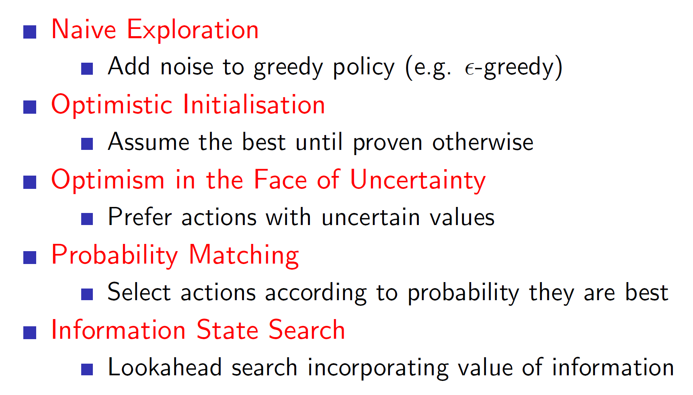

Till now, we used the naïve approach of epsilon-greedy to explore. That
is, we explored randomly with a small probability epsilon and acted
greedily with a large probability 1 – epsilon. **However, randomly
exploring the environment is obviously not optimal.**

**Better approaches than naïve exploration:**

**Optimism in the face of uncertainty:** The idea behind optimism in the
face of uncertainty is to be optimistic about the unknown. **Example**:
If there is a 70% chance of getting a reward of 100 and another action
may lead to a reward of 1000 with a 30% chance then we should explore
the action with 30% chance.

**Information state search:** Information state search uses previous
information to make informed decisions. **Example**: If we are in a room
and we know what is behind some door vs if we are in a room and we don’t
know what is behind some door. The first case is much more useful as we
are using previously known information to our advantage.

**State action exploration vs parametric exploration:**

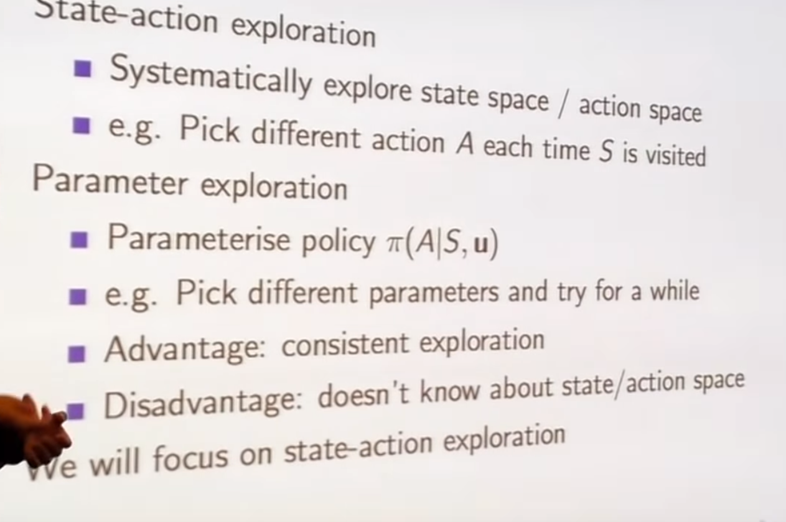

In state action-exploration we **systematically** try out new things.
**Example**: Consider we have been in the state s before and had taken a
right from that point. So, when we are in that same state again, we
would likely take a left in state action-exploration; that is,
systematically try out different things.

In parameter exploration, we control our agent using some parameterised
policy. Once we choose the parameters, **we try it out for a while. This
introduces consistency.**

**Example**: An agent which would explore based on some fixed policy
(parameters) is better than an agent which takes some random action at
different states. That is, taking random actions may not lead to useful
results but taking consistent actions while exploring may lead to better
results.

**Multi-arm bandits**

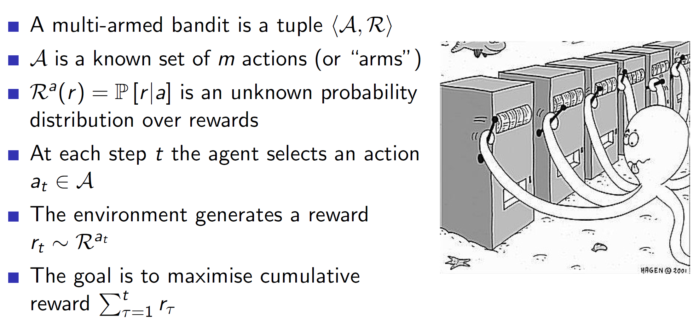

The multi-arm bandits problem can be thought of as having many one-step
slot machines. That is, say we have 10 slot machines in front of us, and
get to pull the lever of one of the machines. Doing this leads to some
reward R. We need to maximise the cumulative reward by pulling these
levers one at a time. Hence, mathematically, a multi-arm bandit is a
tuple of action and reward (A, R). **Notice that it is state-less.**

**Example**: One of the slot machines may have a 70% chance of giving a
reward of 100, another may have 20% chance of giving a reward of 200
etc. We need to maximize the cumulative reward.

**Regret**

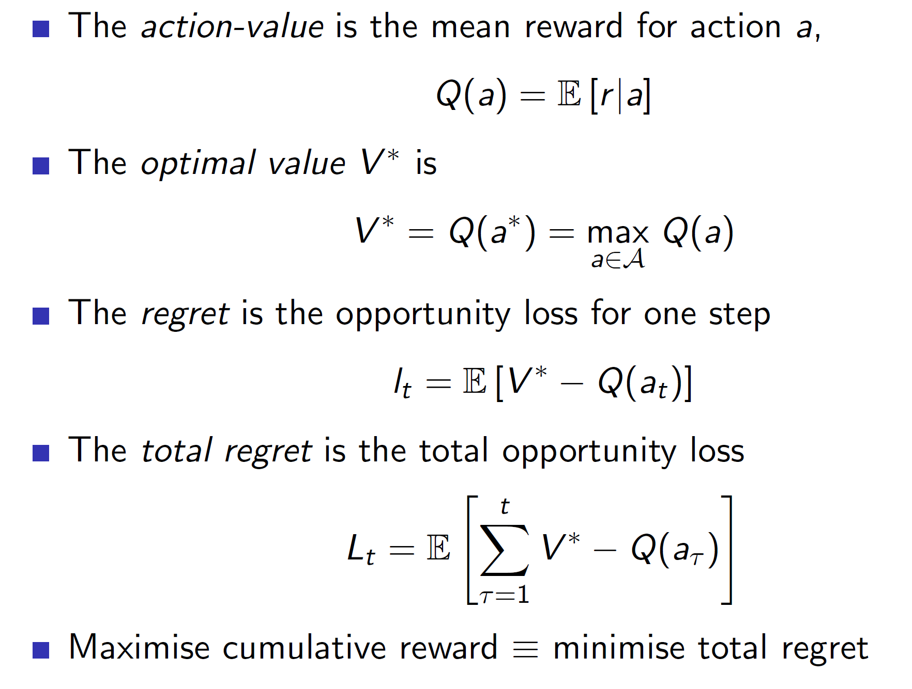

Instead of maximizing the cumulative reward, expressing the problem as
minimizing the total regret has certain advantages.

Firstly, regret is the difference between the best we could have done
(V\*) and the action which we took Q(at). ***Note that here
we are assuming that we somehow know the value V\* (the optimal
value).***

**Advantage of using regret instead of reward:** By expressing the
problem in the form of regret, we get to compare different algorithms in
terms of exploration. That is, every algorithm will improve the
cumulative reward (curve will keep on increasing), but by comparing the
regret, we can find if the algorithm is decreasing/plateauing the curve.

**Counting regret:**

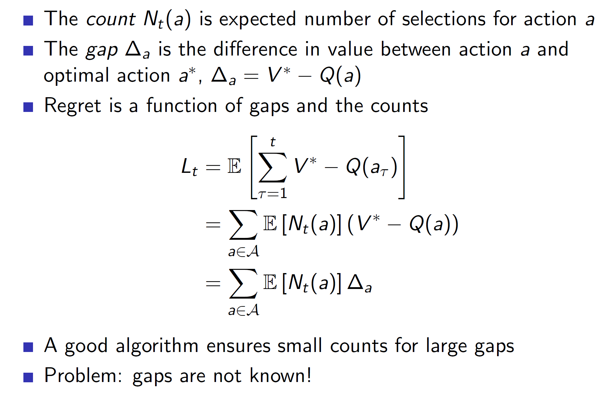

Regret can be expressed as shown above. Every time we take some action
a, we increase its count Nt(a). The difference can be thought
of as a gap between the best and our action. **So, basically, we want to
build an algorithm which would decrease the gaps as the count
increases.**

**Linear vs sublinear regret:**

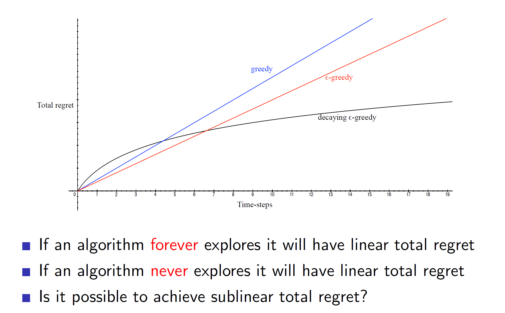

As shown above, greedy and epsilon-greedy never end up plateauing. That
is, the **cumulative** **regret** keeps on increasing linearly. However,
decaying e-greedy works very well and ends up plateauing. That is,
eventually we end up taking the optimal action and close the gap.

**Analysis of greedy algorithm:**

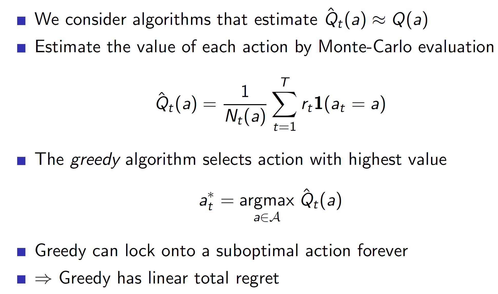

In greedy algorithm as we select the max action every time, we may ned
up locking on a suboptimal path forever. Example: Say one machine has a
80% chance of giving a reward of 10, another has a 50% chance of giving
a reward of 100. Now, we try machine 1, get a reward of 10, try machine
2 get a reward of 0 (we got unlucky). Now, we will end up choosing
machine one every time (suboptimal action).

**Optimistic initialization:**

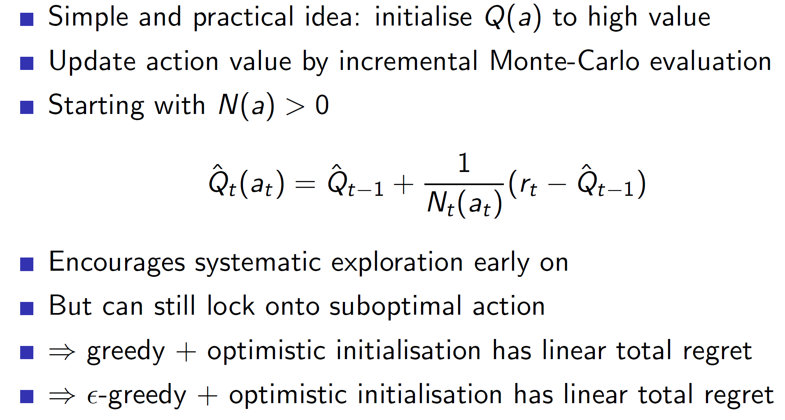

In optimistic initialization, the initial values of Q(a) for all a’s are
high. Hence, every action is highly likely to be chosen (as they have
high initial values). The values of bad actions will become smaller over
time. That is, say some bad action a has an initial value of 100. If the
agent takes it and finds that a paltry reward was received, the action
value will be decreased. That is say reward received was 10. Then we
have 100 + ½ \* (10 – 100) = 100 – 45 = 55. However, 55 is still
relatively high. Hence, the action will be tried a few more times till
it becomes substantially small. That is, we are trying every action
enough times before determining that it is shit.

However, if we are really unlucky, that is a good action ends up giving
bad rewards for say 4-5 tries then we will never try it again and we may
end up locking into a suboptimal solution.

Epsilon-greedy:

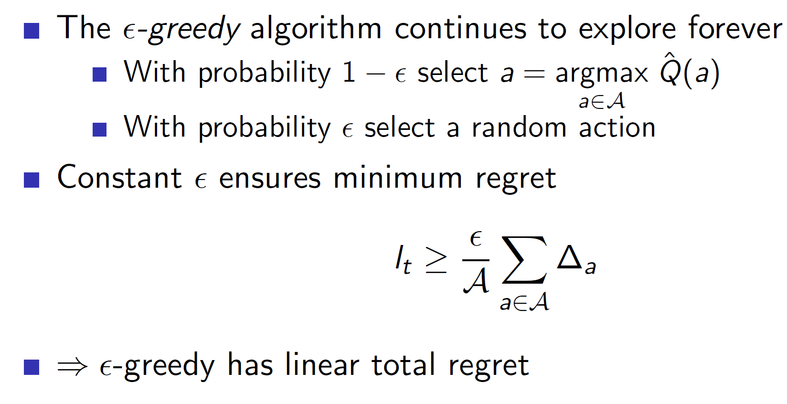

In epsilon greedy as we continue exploring **forever (as it is
non-decaying scenario), we will end up accumulating regret in each
turn.**

**Decaying epsilon-greedy:**

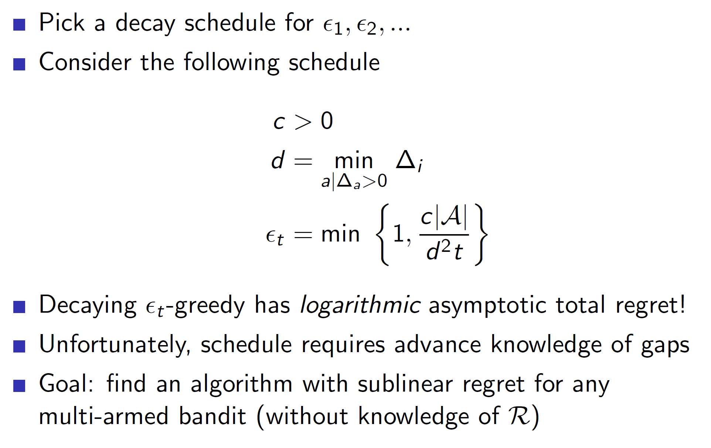

Consider the decaying schedule shown above. At every time step, we
choose d, that is the difference between the **best action and the
second-best action.** Intuitively, if the difference is large then the
term c|A|/d^2\*t will become smaller, i.e we would explore the second
best action and subsequent actions a lot less as they are significantly
worse than the best action. On the other hand if the difference is
small, the c|A|/d^2\*t term will be larger. That is, we would explore
these actions with a higher probability.

**Note**: This cannot be done in practice as it requires advanced
knowledge of gaps (we need to know the optimal value V\* for each
action).

**Lower bound for regret:**

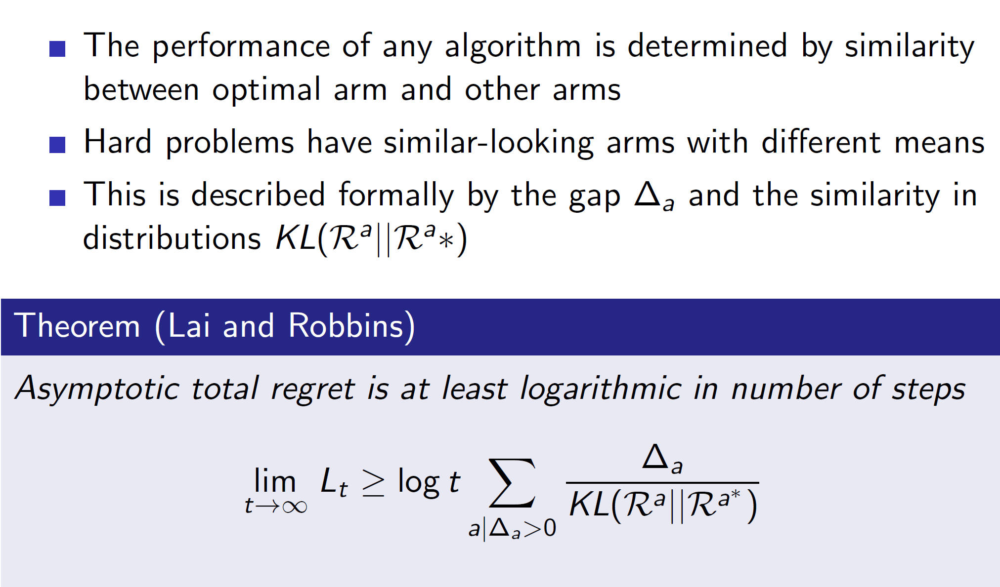

It can be proved using KL divergence that the lower bound of regret is
logarithmically asymptote. **That is, the optimal regret curve will be a
logarithmic curve.**

**Hence, the best algorithm will be that which leads to a logarithmic
curve of regret. (Example – decaying e-greedy).**

**Optimism in the face of uncertainty:**

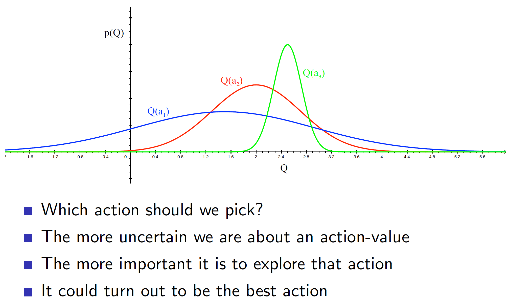

Consider the three action value distributions (Q(a1), Q(a2), Q(a3)). We
can see that action Q(a1) covers a larger area and has a small chance of
getting the highest reward amongst the three actions. Hence, an
optimistic agent will choose Q(a1).

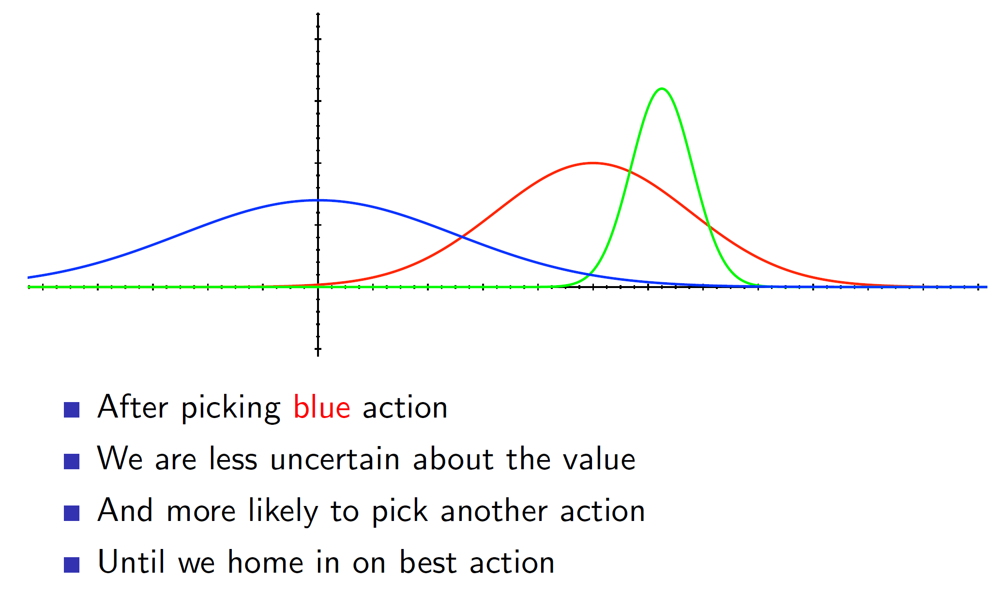

Consider that after choosing Q(a1) (blue curve), we got a small reward.
Now, we would update the distribution and now we would be less likely to
choose Q(a1) again.

**Problem: We need to find some way of forming these distributions or
obviating their need**

**Upper Confidence Bounds:**

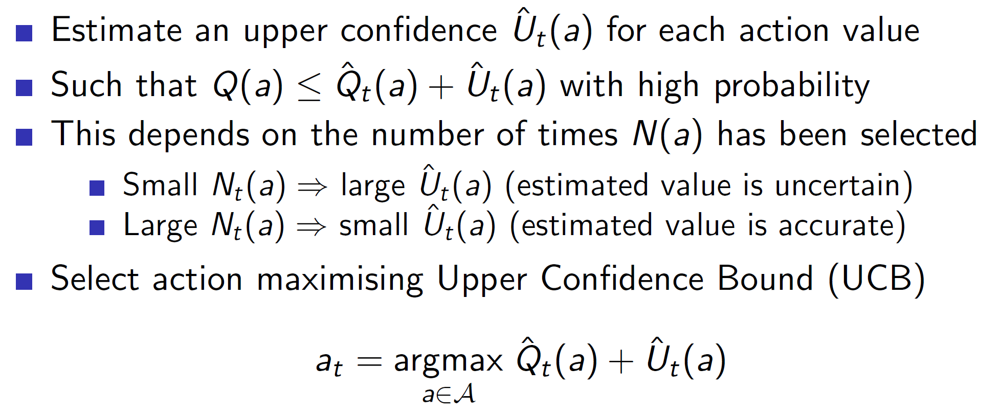

Upper confidence bound obviates the need for forming the distribution.
We define an upper confidence Ut(a). So, basically, the
action value has a reward value anywhere between Q\_cap(A) to U(a). **As
we try out the action more and more, the value of U(a) will decrease,
that is we become less and less uncertain about our choices.**

**Hoeffding’s inequality:**

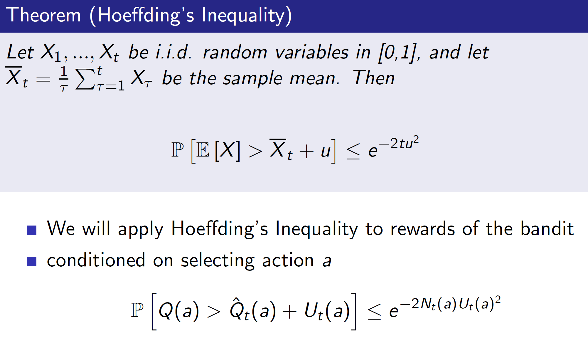

Hoeffding’s inequality says that the probability of the sample mean
Xt being greater than the actual mean E\[X\] by u has an
upper cap of e-2tu^2.

We can use this to represent our upper confidence bound and find the
value of U(a).

**Calculating the upper confidence bounds:**

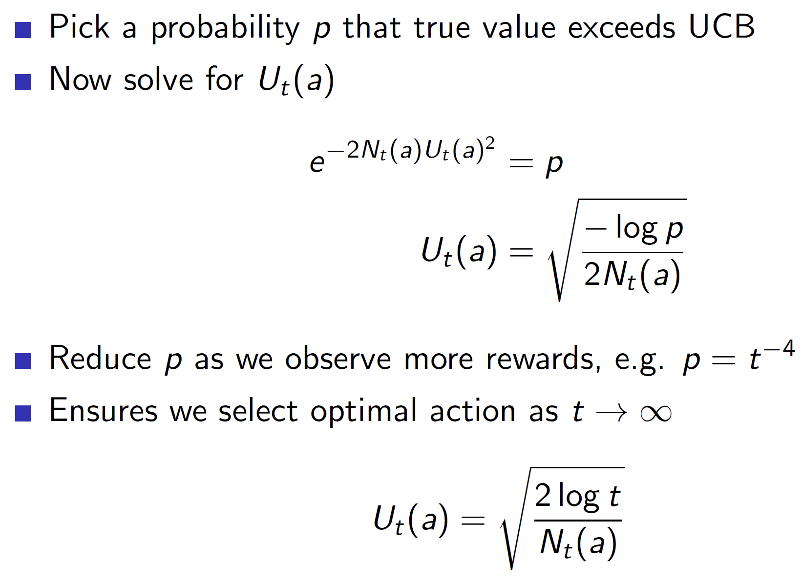

We start by selecting a large probability p. Say p = 0.95. That is, the
initial uncertainty is high. We can then calculate Ut(a) as
shown above (we have taken log on both sides and solved for
Ut(a)). As we can see, the Nt(a) in the
denominator ensures that Ut(a) becomes smaller as the number
of times the action gets chosen increases.

We should also reduce the value of p for faster convergence.

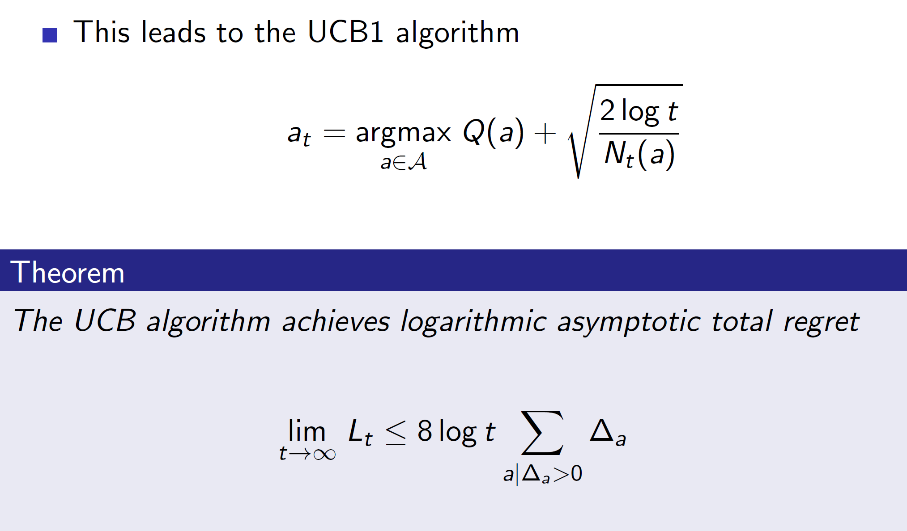

By using this strategy, we achieve logarithmic total regret.

**Bayesian Bandits:**

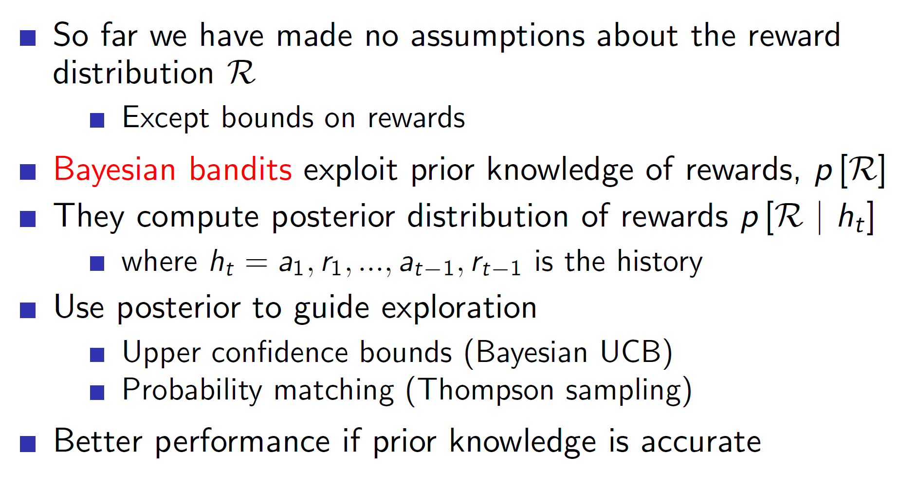

In Bayesian bandits**, we exploit** **prior knowledge of rewards.** That
is, we have a history of knowledge involving some actions and their
respective rewards. Using this, we can build up distributions for each
Q(a).

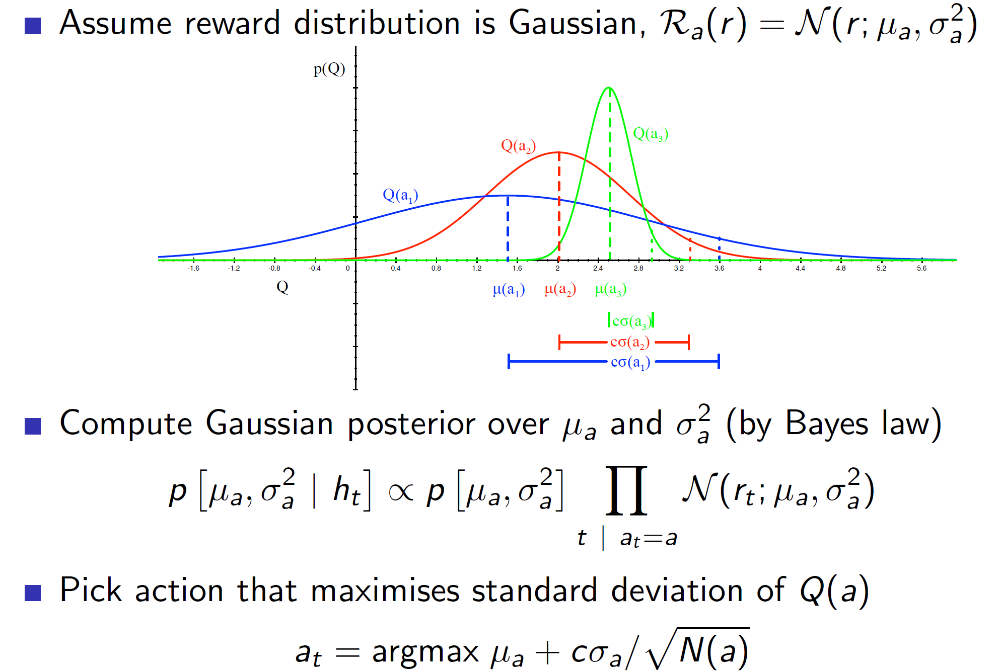

Assume a Gaussian distribution. We can make use of the prior knowledge
to build up distributions as shown above. Then, we can estimate the
upper confidence bound by using standard deviation.

I.E c\*standard\_deviation/(sqrt(N(a)) is the upper confidence bound.
Now, we simply maximize using the UCB1 algorithm.

**This algorithm will only work well if the prior knowledge is
accurate.**

**Probability matching:**

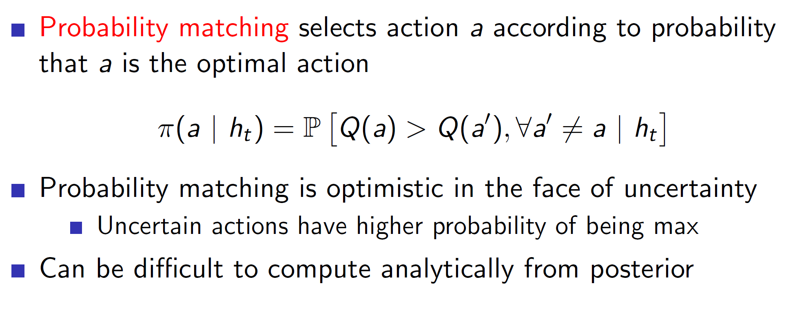

In probability matching, the actions are picked in proportion to their
probability. Example: If there are two actions, one of which has a 70%
chance of being the best and other has a 30% chance of being the best
then the one with 70% chance will be picked 70% of the times and other
action will be picked 30% of the times.

**Thompson Sampling:**

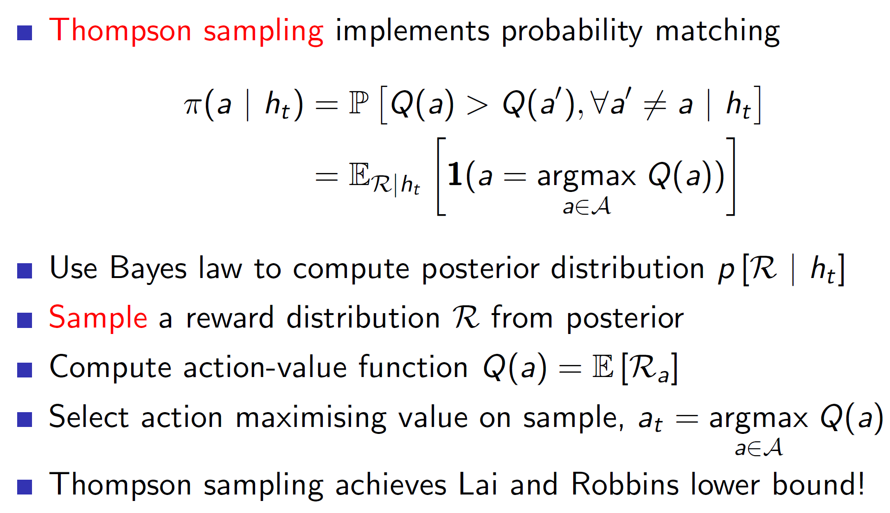

Thompson sampling is one of the earliest and simplest of ideas. In it,
we sample from each of the distributions and pick the maximum. For
example, consider the following distribution:

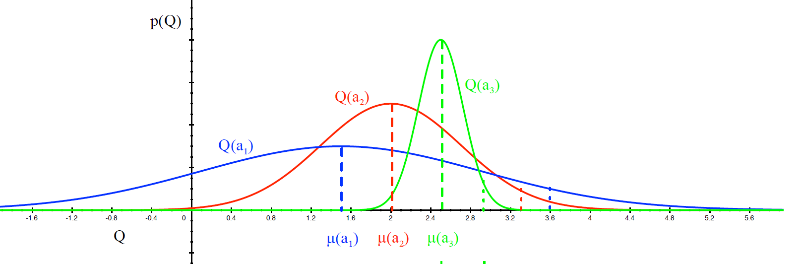

We will sample a value from Q(a1), Q(a2) and Q(a3). That is, we get
three values from those three distributions (actions). Now, we simply
pick the max of the values.

**Value of information:**

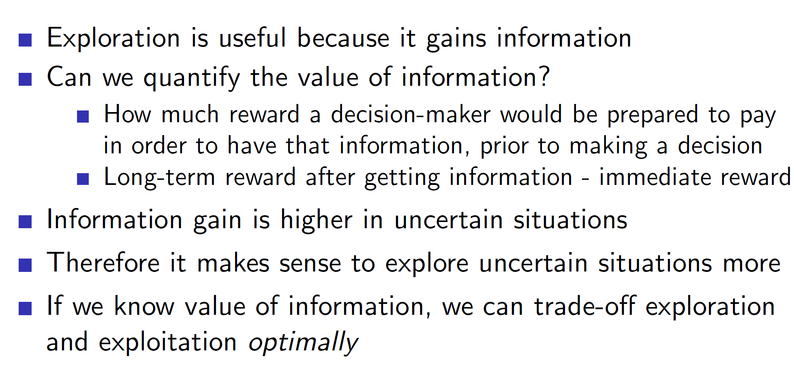

The value of information can be thought of as how much is taking an
uncertain exploratory action worth? Mathematically, it can be thought of
as long-term reward after getting the information – immediate reward.

**Information State-Space:**

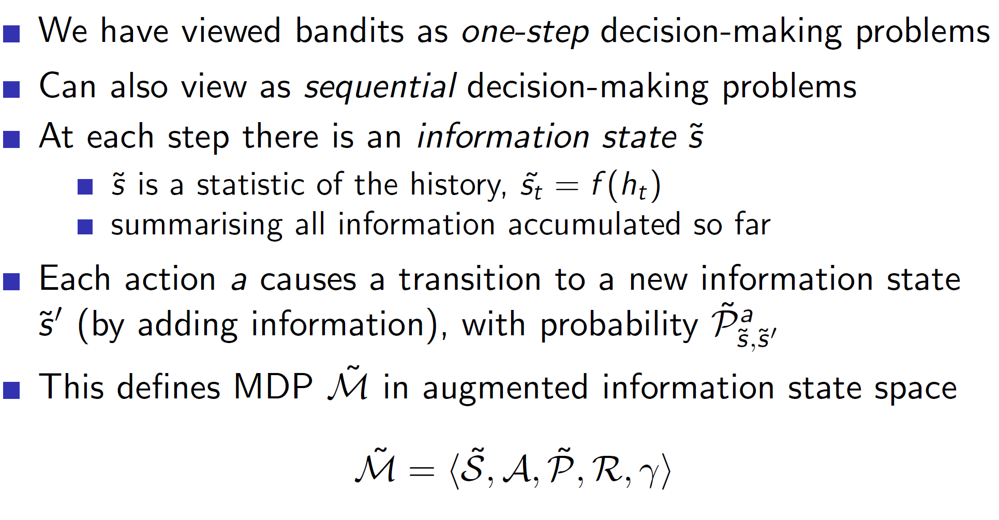

In information-state space, we store information about the environment
and use it to explore the environment better. The bandit problem can be
converted to a sequential decision making problem from a one-step
decision making problem. Hence, we define an information state S\_tilde
and a probability matrix P\_tilde. By definition they satisfy the Markov
property and hence, we can now express the problem as an MDP.

Example: Bernoulli Bandit

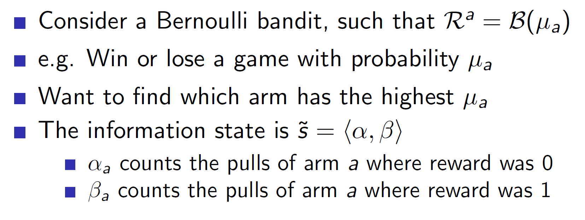

Bernoulli Bandit is a special case of multi-arm bandit which issues a
reward of 1 with probability p and a reward of 0 with a probability 1 –
p.

Consider the problem where we win a game with probability u. For this
problem, we maintain a simple information state which is basically a
count of times we won and loss. Alpha counts the times we lost and Beta
counts the times we won.

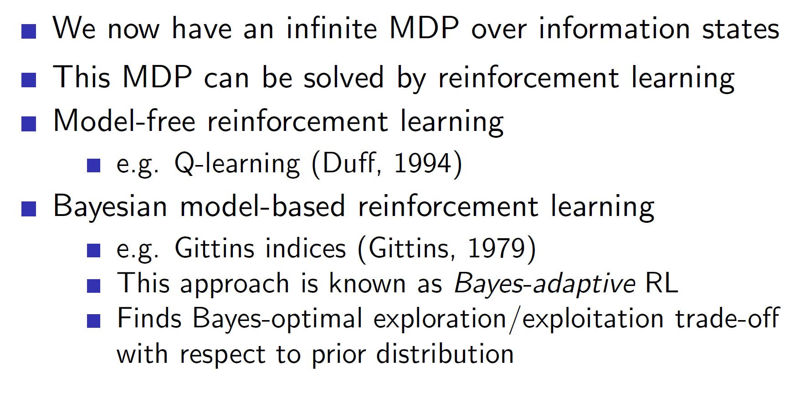

Once we do this for countably infinite times, we can use any algorithm
to solve the MDP.

**Gittins indices (Bayes Adaptive RL):**

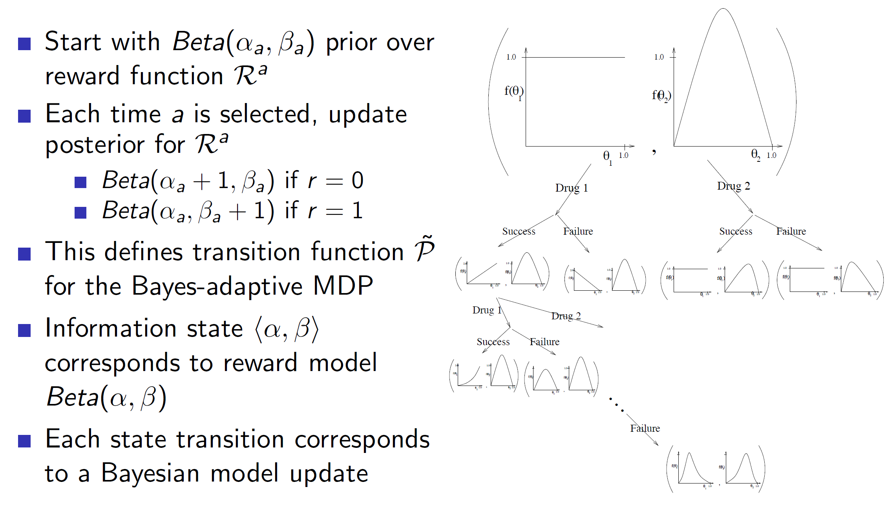

Gittins indices is a dynamic programming solution to the bandits
problem. We basically form a tree consisting of different scenarios and
use it to update our information state. Basically, at each node of the
tree, we are summarizing everything we know about the actions using
distributions. We can see that we started with two initial drugs with
some initial distribution and they got updated at every node. This is
the Bayes Adaptive approach. **Note that, solving Bayes Adaptive MDP
using Dp is called Gittins index.**

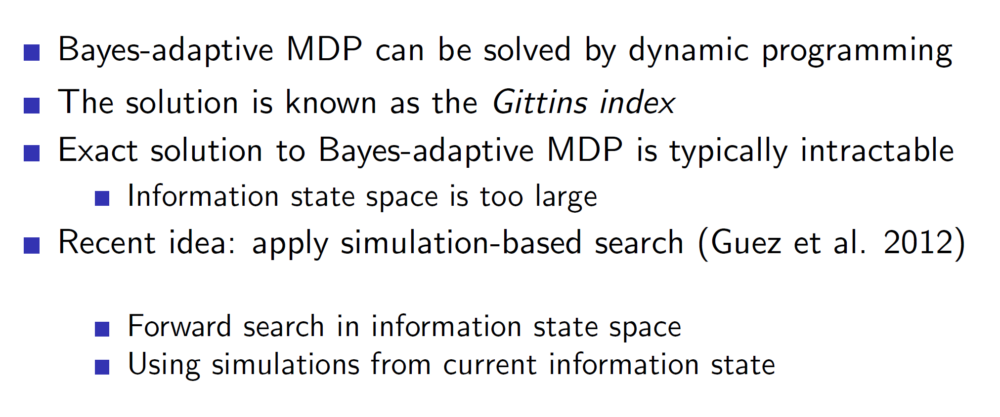

In reality, exact solution cannot be found in tractable time.

**Summary:**

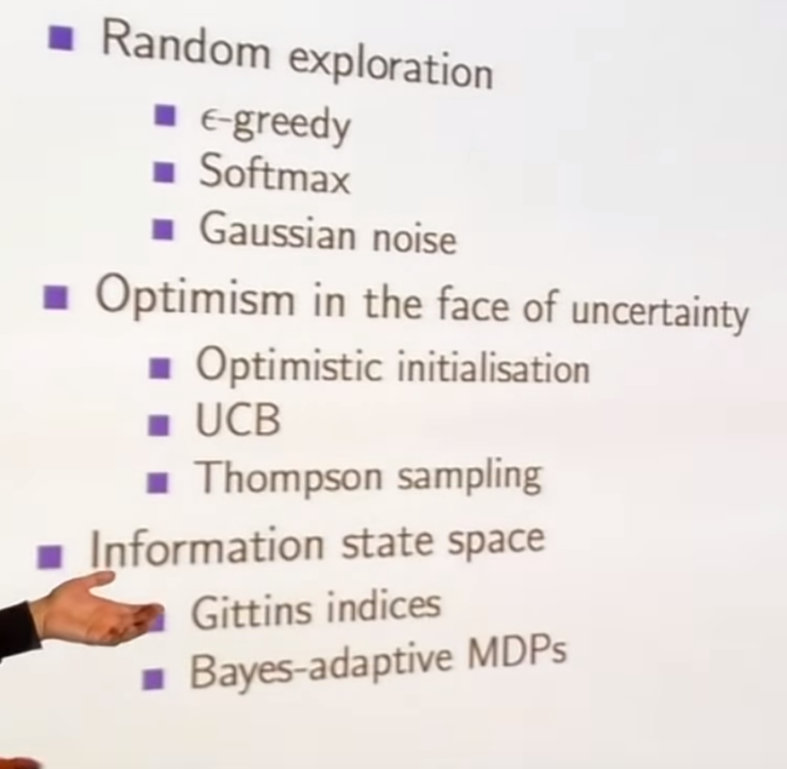

**Contextual bandits:**

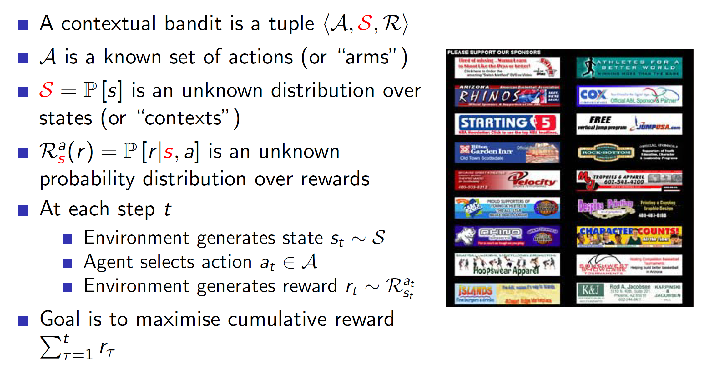

In contextual bandits, we also introduce the idea of states (context).
So, now the tuple becomes (A, S, R) instead of (A, R).

Example: Consider the problem of ad-placement. The ads will be placed
based on the user who has entered the website. That is, if the user is
an Indian, male then there will be some particular placement of ads etc.
Basically, we are taking actions based on the context (S).

**Using linear regression to estimate the value function:**

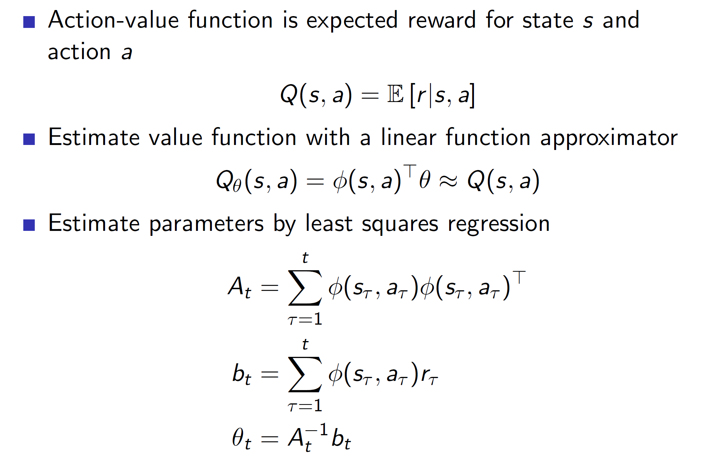

We can use a linear approximation of the action-value function which
would improve over time (the parameters will improve).

**UCB:**

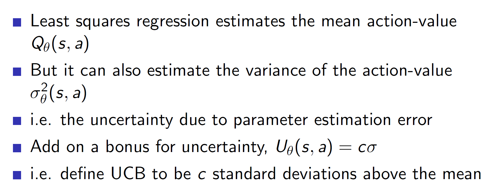

We can also estimate the variance to calculate the upper confidence
bound U.

**Geometric interpretation:**

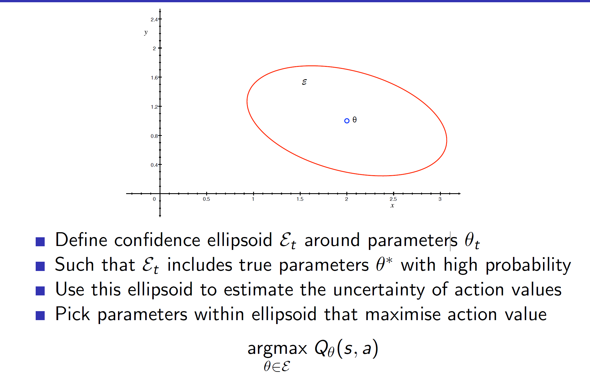

We are essentially defining a ellipsoid around the parameter theta. This
ellipsoid will account for the uncertainty (upper confidence bound).

Hence, we get:

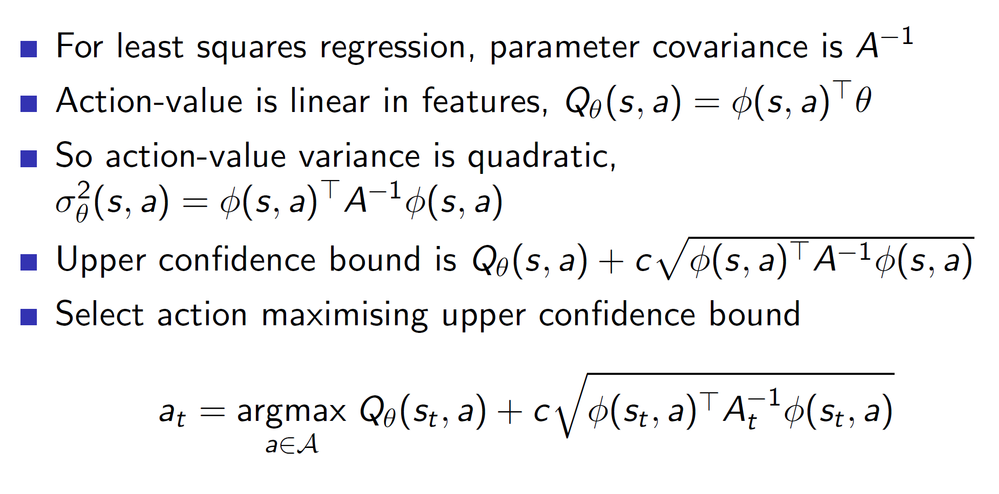

**Extending the algorithms of bandits to MDP:**

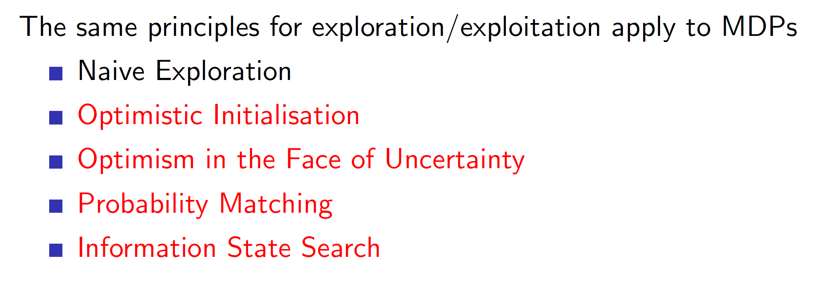

**UCB in MDPs**

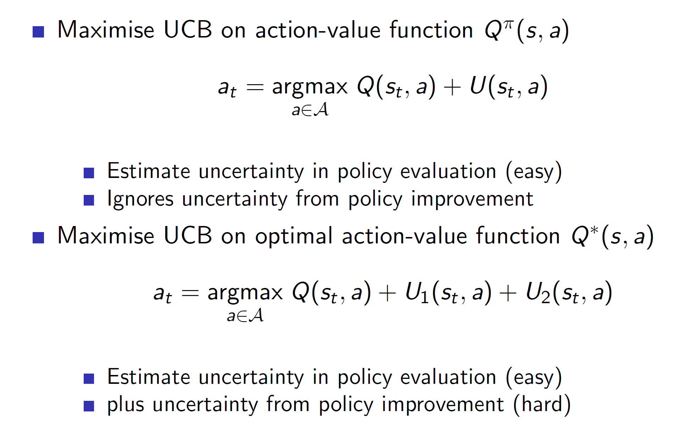

**Problem:** When we are dealing with MDPs the Q(s, a) value itself
keeps improving as the policy improves. So, there is not only
uncertainty w.r.t U(s, a) but also Q(s, a). Hence, the problem becomes
much harder in case of MDPs.

**Example 2: Optimistic initialization in MDPs**

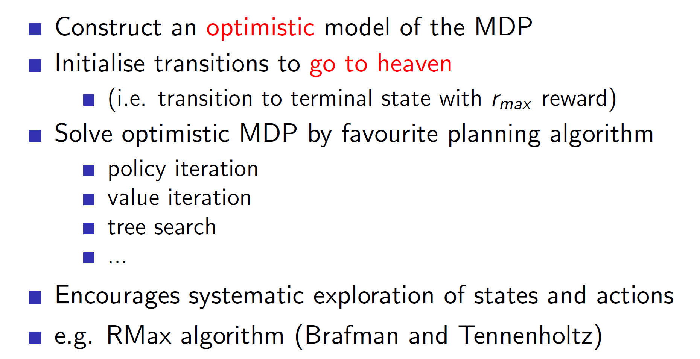

The idea of the rmax algorithm is to build an optimistic model by
imagining that every transition leads to heaven (best scenario). Once we
actually start solving, we find that many of those states are actually
bad and we can reduce the values appropriately.

**Information state space MDP:**

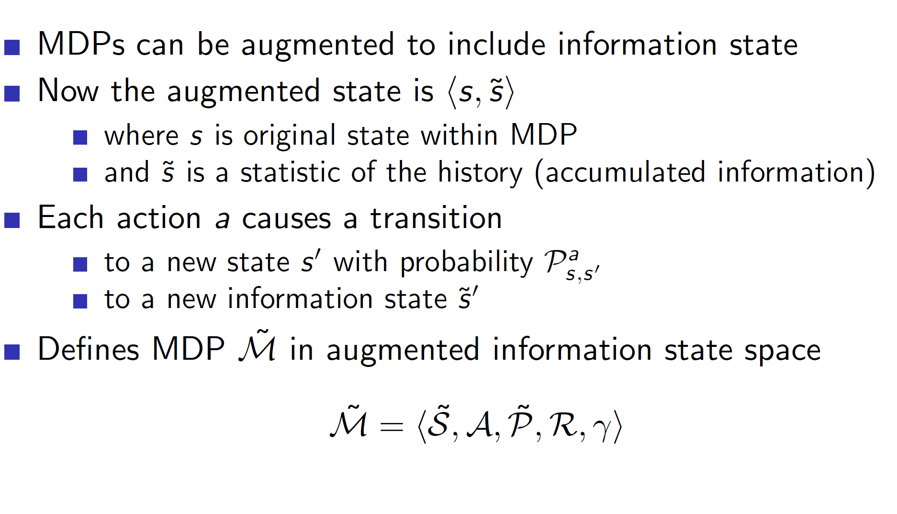

We basically combine the actual state s with the information state
s\_tilde into an augmented state S\_tilde.
