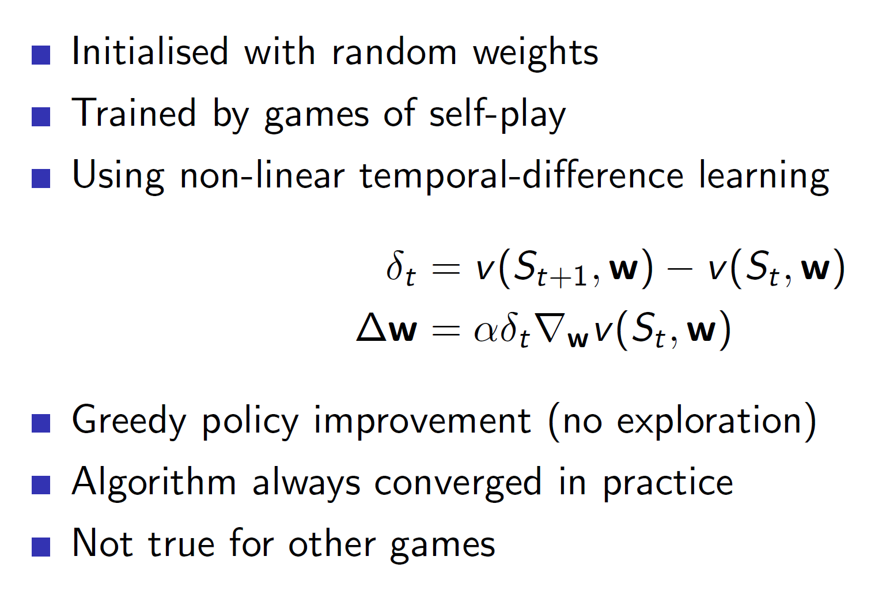
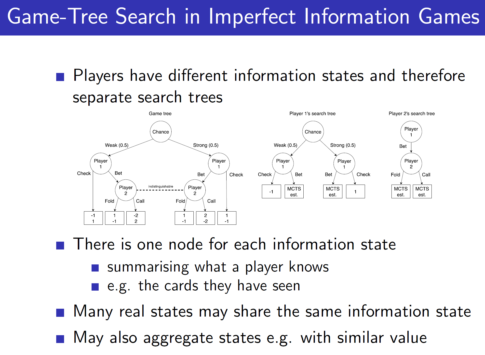

*****
**Lecture Details**
* **Title:** Appling RL to Games  
* **Description:** The lecture notes are based on David Silver's lecture video. 
* **Video link:** [RL Course by David Silver - Lecture 7](https://www.youtube.com/playlist?list=PLbPhAbAhvjUyrKlhnLEMyNmiF72ABB3Zh){:target="_blank"}
* **Lecture Slides:**  [Slides](http://www0.cs.ucl.ac.uk/staff/d.silver/web/Teaching.html){:target="_blank"}

**Credits: All images used in this post are courtesy of David Silver** 

*****

**Why study games?**

Games have complicated rules and require logic to play. Playing games
optimally displays intelligence and acts a test of IQ.

Games are called Drosophila of AI. Drosophila is latin for fire bug –
i.e an insect used widely in biology for conducing tests

Therefore, as games require intelligence and logic they are a good
testing grounds for intelligent agents.

**Optimality in games:**

There are two main types of optimality in games.

  - **Best response optimal policy** is the optimal policy against some
    fixed opponent policy. Example – Consider that in a game of Rock
    Paper Scissors, the opponent always plays scissors. Then the best
    response would be to always play rock. **But remember this best
    response is w.rt this specific opponent only.**

  - **Nash equilibrium** is a policy in which all players play
    optimally. That is, we make agents play against themselves where
    every agent is trying to give the best possible response against
    every other agent. By improving the agents in such a scenario, the
    agents eventually learn the optimal policy and this point is known
    as the Nash equilibrium.

Note: The point of Nash equilibrium may or may not be unique.

**Single agent vs self-playing agents:**

In singe agent problem, we consider the other players as part of the
environment. Hence, this becomes a normal RL problem where the
environment outputs some states and rewards. Best response policy is
used to solve single-agent problems.

In Nash equilibrium we use self-play between agents. That is, agents
will play one another and eventually improve. Note that, a single agent
may play against itself other than having multiple agents play against
each other.

**Two player zero-sum games:**

A zero sum game is a game in which two players are trying to defeat each
other and hence, have opposite rewards. I.E A positive reward for player
1 is negative for player 2.

**Perfect and imperfect information games:**

**Note: There is no single perfect way of solving games.**
**Reinforcement Learning should be used with Searching to get best
possible results.** **That is, searching is an important process in game
agents and one shouldn’t solely rely on reinforcement learning.**

**Minimax:**

Minimax policy is basically the minimax algorithm where a tree is built
in which the two players choose the best possible move at that stage
(max/min). **A minimax policy is a Nash equilibrium.**

**Minimax search example:**

We can see that the values at leaf node were obtained and propagated
upwards all the way to the root.

**Problem with minimax:**

The tree search is impractical in practice as the size of search tree
grows exponentially. Hence, in practice function approximators like
neural networks are used to approximate the value. That is, minimax
search is executed till its computationally feasible and that data is
used to approximate the final leaf-node value.

**Using pre-defined features: Binary Linear value functions**

Games have many pre-defined set of features which are used to calculate
the “goodness” of a state. As we can see above, arrangements can be
shown using a binary vector where the vector gets a “1” if the
designated piece is actually at that place on board or 0 otherwise. Each
such piece is given a weightage. After we multiply, we get a single
scalar value telling us the goodness (value function) of that state.
**Note**: Here negative weights show harmful positions (i.e opponents
position)

**Deep Blue: The Chess agent**

Deep Blue used a combination of pre-defined features and search
heuristics.

**Chinook: Checkers agent**

The chinook agent along with binary-linear function (hand-crafted
features) and minimax search, **used a retrograde analysis. In this, the
agent searches backwards from win positions.**

**Self-play agents: Reinforcement learning**

Now coming to reinforcement learning, the algorithms are pretty much the
same we have seen before. Here, in case of MC v(St, W) gives
the estimate of who would win from state St. Then when the
game is finally over, it is updated towards the actual win (reward)
Gt.

In case of TD, v(St, W) gets updated towards the successor
state. That is, the agent has some estimate of V at state St.
Then when the agent actually plays and reaches state St+1, there will be
some new estimate. We update the V(St, W) towards this new
estimate.

**Policy improvements using afterstates:**

In deterministic games, we know the rules. That is, we know that a horse
in chess can move 2 and half places to the left or right and so on.
Hence, we know exactly where the piece will end up when that move it
played. Or in terms of agent, we know exactly the state which the game
will move to.

So, the policy can be improved by exploiting this idea of afterstates.
As we know the rules and the states which the game will move to, we can
simply try out these states in our mind and then choose the action which
maximises the after state value.

**Self-play TD: Othello in game Logistello**

The game agent Othello was able to develop its own features using some
basic input features.

It used generalized policy iteration to perform RL.

**TD Gammon: Non-linear approximator for Backgammon**

The TD Gammon feature vector basically flattens out the board and counts
how many of the checkers are there on each location. This is then passed
to a neural network which spits out the state value function.

So the main difference between TD Gammon and previous agents is that TD
Gammon uses a non-linear function approximation (neural network) to
approximate the value function.

**Self-play TD in TD Gammon:**

Notice that, TD Gammon uses temporal difference learning with **only
greedy policy improvement.** That is, epsilon greedy or other techniques
of exploration are not used. Yet, the algorithm manages to converge in
practice. **This is because Backgammon uses a dice. The element of dice
brings stochasticity to the game and thus, there is an implicit
exploration. Due to this, a greedy policy is able to reach optimality.**

When this TD learning was combined with searching and hand-crafted
features, the agent was able to defeat the world champion.

**Combining reinforcement learning and minimax search:**

Like it was mentioned before, searching is an important step in gaming
agents. It shouldn’t be ignored.

One naïve way of combining RL with Minimax search is to first use TD to
update towards the successor value and then use this approximated value
function to perform minimax search.

**Results of using Simple TD:**

As we can see, for complicated games like Chess and Checkers it leads to
poor performance.

**TD root:**

In TD root, we first perform a minimax search from state St
and store the outcome. Now, we play for real and reach the next state
St+1. Now, we perform minimax search in this state
St+1 and get the outcome. **The value function at
St is updated towards the outcome of the minimax search of
state St+1.** The important thing to note is that we are
updating the value function towards the outcome of the minimax search
and not towards the value function St+1. From the figure, the
state St+1 leads to scenario with green node. So we update
the St node such that it goes closer to the green node.
**That is, the node St should be able to predict the green
outcome without performing the minimax search.**

**TD Leaf:**

In case of TD leaf, we again use minimax search at state St
and state St+1. But now, we also update the leaf value node
attained at state St towards the leaf value node attained at
state St+1. **That is, we are not only creating a better
value estimate at state St but also a better minimax search
estimate from state St. **

**Tree Strap:**

In TreeStrap we use update nodes at every level towards nodes at deeper
level. That is, the nodes at higher level should be able to predict what
the nodes at deeper level are predicting.

Note, this algorithm can only work well if they are a sufficient number
of real-world estimates within the search tree. Otherwise, we would just
be updating towards a biased fake optimal solution (as we are simulating
the search tree).

**Simulation based search:**

The UCT algorithm basically uses Monte-Carlo Tree Search seen in
previously lectures but additionally considers every node as a bandit.
That is, every node now has a upper confidence bound associated with it.

**Performance of Monte Carlo Tree Search and UCT:**

**Simple Monte-Carlo search in Scrabble: (Imperfect information game
problems)**

Notice that scrabble is an imperfect information game as the other
player’s letters are not visible to us.

**Game tree search in imperfect games:**

Notice that in imperfect information games like Poker, **every player
has a different search tree.**

**Solutions to imperfect information games:**

**Smooth UCT:**

Smooth UCT is a variant of normal UCT algorithm where the current
experience is taken into consideration. The agent takes the current
opponent’s behaviour into consideration and learns to respond against
the **average of it.** The action is picked from UCT algorithm with a
high probability and with a small probability pick a action which plays
best against the average behaviour.

In conclusion, a RL agent should be combined with searching methods,
function approximators and hand-crafted features to form a robust and
intelligent agent.
