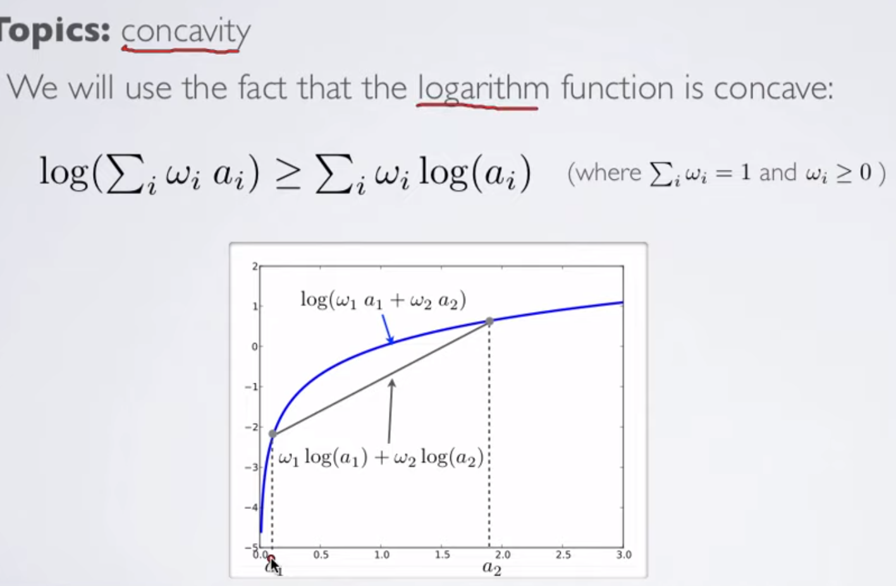
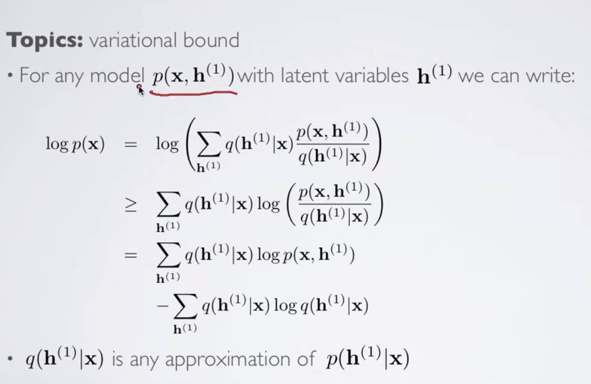
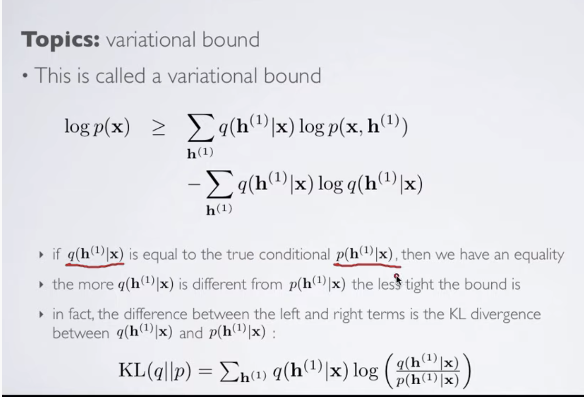
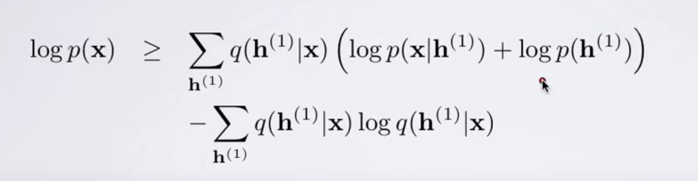
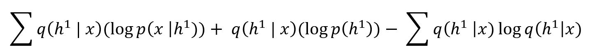
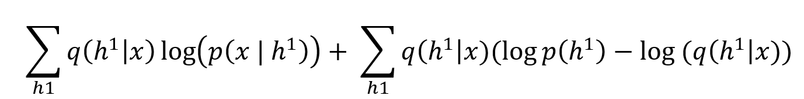
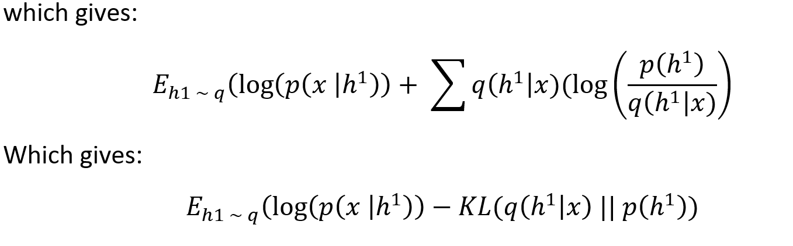

**Original Video link:**
* [Variational Lower Bounds](https://youtu.be/pStDscJh2Wo)

**Credits: All images used in this post are courtesy of [Hugo Larochelle](https://www.youtube.com/channel/UCiDouKcxRmAdc5OeZdiRwAg)** 

The idea of putting a lower bound on log of a function is based on idea
of log concavity:

As logarithmic function is concave, it is true that log(sum(wi\*ai)) \>=
sum(wi\*log(ai)).

We exploit this idea to have lower bounds on our likelihood functions.

Here h(1) is the latent variable; i.e., we say that
probability of our data x is based on latent variables h (variables
which we cannot directly observe but we can use them to inference about
our data).

As we can see, we have simply applied the log concavity idea to get the
\>= shown above.

**Also, note that here the distribution q(h|x) is any arbitrary
distribution. The choice of this distribution is up to us.**

We can see an interesting property. If the chosen distribution q(h|x) is
same as p(h|x) then the right hand side equation reduces to log(p(x));
hence we are just calculating the likelihood directly.

**Now, we know p(x, h) = p(x | h)\*p(h), hence, log(p(x, h)) will be
log(p(x|h))\*p(h).**

We use this idea as follows:

Then, we get the following:

Which can be refactored as follows:

**Note:** The negative sign in front of KL divergence is because we need
to invert log(p(x)/q(x)) to

\-log(q(x)/p(x)) to bring it in KL divergence form.
