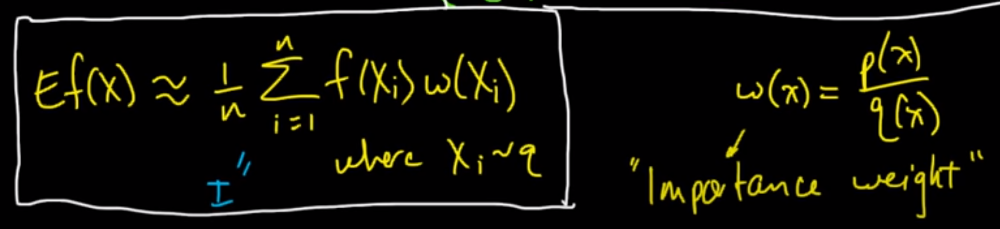

*****
**Original Video link:**
* [Importance Sampling: Intro](https://youtu.be/S3LAOZxGcnk)
* [Importance Sampling: Intuition](https://youtu.be/3Mw6ivkDVZc)
* [Importance Sampling: Normalizing constants](https://youtu.be/gYvlnu5AAzE)

**Credits: All images used in this post are courtesy of [Mathematical Monk](https://www.youtube.com/channel/UCcAtD_VYwcYwVbTdvArsm7w)** 

**Importance Sampling: Introduction**

Sampling is actually a misnomer. Using Importance Sampling we are
essentially approximating the **expected value** of some distribution
p(X) using another distribution q(X).

We use importance sampling when it is difficult to grab samples from
original distribution p(x), so we estimate it using q(x). We might also
use importance sampling when we want to give “importance” to certain
areas of original distribution. Basically, say we want to grab more
samples from areas from original distribution which occur rarely. We can
design our q(x) such that we grab more samples from this region.

Another important thing to note is, **even though we are assuming it’s
difficult to grab samples from p(x), we still should be able to
calculate value of p(x) given some x.**

Mathematically, we just multiply and divide the expected value formula
with q(x) as shown above. (Here distribution q(x) should be equal to
zero when p(x) = 0; it’s called absolute continuity).

The p(x)/q(x) term can be basically thought of as a “weight” term.
Hence, the formula becomes:

**Can importance sampling estimate even better than original P(X)?**

So, the cool thing about importance sampling is that if we choose our
q(x) correctly then we might even be able to estimate better than
directly estimating from p(x). **We do this by reducing the variance
term.**

**Intuition behind choosing a “good” Q:**

Consider the figure shown above. Let the red line denote the return
which we get (here return is just the values represented by our
probability distribution p(x)). Now, p(x) represents our probability
distribution. As we can see, most of the density is away from the huge
negative spike in return. So, if we use something like Monte Carlo
sampling, we won’t be able to estimate the true average properly as we
will be grabbing samples from the dense area. So, it’s very unlikely
that we get a f(x) where we experience that huge negative spike. But
from the equation we can see that the huge negative spike is greatly
affecting the expected value because even though p(x) is small, |f(x)|
is significantly large hence the overall expected value will be
influenced by such f(x)\*p(x) entries. If we choose q(x) as shown above
we can solve this problem.

**Example of a bad q(x):**

In this example, we can see that q(x) covers irrelevant regions and so
it will be a bad estimate of the actual expected value.

**Looking at this from another perspective:** However, this also shows
the power of importance sampling. If for some reason we want to sample
more from these “irrelevant” regions then we can simply design our q(x)
such that we end up sampling from these regions. So, using importance
sampling we are able to choose regions of importance to sample from.

**But in general, we choose q(x) such that |f(x)|\*p(x) is large when
q(x) is large.**

**Importance sampling without normalization**

Till now we were assuming that we could calculate f(x) and w(x)
(p(x)/q(x)) efficiently for all values of x. However, in reality, we
might know p(x) and q(x) only up to a normalizing constant. So, how do
we calculate w(x) efficiently in this case?

Look at the image shown above. We can see how p(x) and q(x) can be
expressed in terms of normalizing constants. Here we say Zp and Zq are
unknown to us. The right hand side integrals are true because integral
of p(x) and q(x) must be 1, hence q\_tilde(x) and p\_tilde(x) should
integrate to Zp and Zq as the fraction should equate to 1.

So, let’s start by rewriting the equations in terms of normalizing
constants:

But we still don’t know Zq/Zp.

However, we can perform Monte Carlo approximations of these as follows:

So, the final equation becomes:

