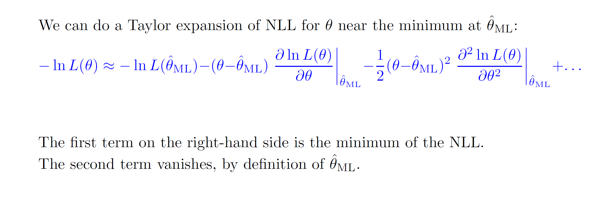

*****

**Credits: All images used in this post are courtesy of [Prof. Michael Schmitt](https://www.physics.northwestern.edu/people/faculty/core-faculty/michael-schmitt.html) and [Ben Lambert](https://www.youtube.com/user/SpartacanUsuals)** 

**Maximum likelihood:**

In simple terms, maximum likelihood is estimating a distribution using a
likelihood function (which is made up some parameters) such that the
likelihood of observed data being a part of that distribution is
maximized.

**For example:**

The red points are the observed data samples. We can see that if we
estimate the distribution using parameter alpha, then only in the middle
diagram the distribution correctly fits the data (i.e, joint probability
of all the observed samples under that distribution is high).

The likelihood function can be defined as follows:

**Likelihood is not probability and the integral of likelihood will have
no interpretation at all.**

If we assume that the set of samples are i.i.d then the likelihood
function can be written as a joint product of probabilities:

Where f(xi, theta) is the probability to observe xi in the interval x +
dx.

**How to maximize the likelihood?**

To maximize, we can take the first order derivative of the likelihood
function and set it to 0. In practice it’s more convenient to minimize
the negative log likelihood instead – as directly multiplying
probabilities could lead to extremely small values; the log function can
handle this situation.

**Taylor series of expansion of NLL:**

The first team -lnL(theta\_ml) is the minimum as by definition of
maximum likelihood, L(theta\_ml) is the maximizing function, so the
negative log of that is the minimum. The second term vanishes as first
order derivative = 0.

So, we are left with the following:

**So, we can see that when N is large, the negative log likelihood can
be represented using the equation of the parabola.**

**So, we can see that sharper the parabola, lower the variance.**

**But why does the second order derivative represent the curvature?**

To understand it intuitively, first let’s look at what the second order
derivative means. It basically means taking the derivative of the
gradient; i.e. it represents the rate of change of gradient.

From the figure above we can see that the pink distribution has a faster
rate of change as compared to the yellow one (The curves are shaper for
the pink). Also, the pink distribution has a lower variance as it is
sharper as compared to the yellow one**. So, we can roughly say that the
variance of the estimator is inversely proportional to the second order
derivative of likelihood function.**

**Fisher Information**

Fisher Information tells us how much information we can get about the
parameter we are trying to estimate given a data sample X. Basically, it
tells us the expected amount of information which sample X carries about
the parameter theta.

So, the variance is proportional to the inverse of Fisher information.
This idea is formalized in the form of Cramer Rao Inequality as follows:

**In brief, the Cramer Rao Inequality says that the variance cannot be
lower than the inverse of the Fisher Information.**
